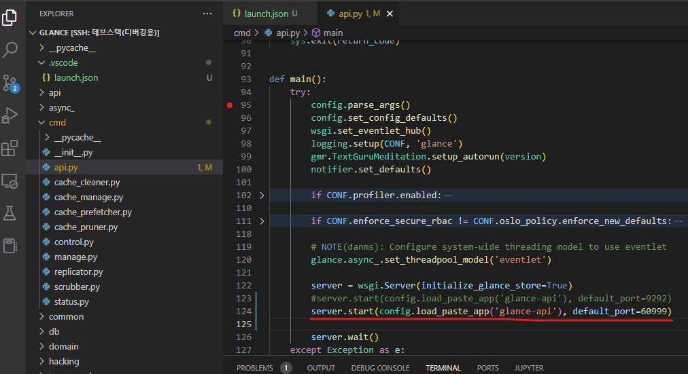
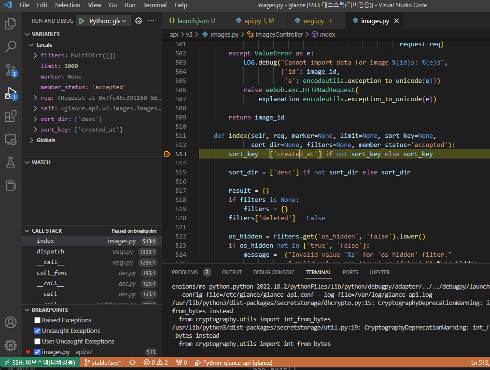

# Debugging glance-api

이 문서는 `glance-api`를 `visual studio code`에서 원격으로 디버깅 하기 위한 환경 설정을 구성한다.

!!! note "Requirements"
    * Ubuntu-20.04 LTS
    * 4 Core, 8 GB RAM 이상 ( for DevStack/ZED )
    * DevStack ZED version basic Installed
    * Visual Studio Code

!!! note
    devstack이 설치된 remote host에 대한 `vscode`의 원격 설정 구성은 [Debugging python-openstackclient](./python-openstackclient.md)와 동일하다. 실행 계정은 `root`

## Stop glance-api service

``` bash title=""
# service devstack@g-api stop
```

## /etc/glance/glance-api.conf
``` ini title="/etc/glance/glance-api.conf"
[DEFAULT]
...
# workers 를 0으로 설정하면, 디버깅용도의 싱글 프로세스가 실행된다.
workers = 0
```

## Install gevent package
``` bash
# pip install gevent
...
Successfully installed gevent-22.10.2 greenlet-2.0.1 zope.event-4.5.0
```

## VSCode 원격 접속
`/opt/stack/glance/glance` 디렉토리에 접속한다.


## launch.json 구성

``` json title=".vscode/launch.json"
{
    // Use IntelliSense to learn about possible attributes.
    // Hover to view descriptions of existing attributes.
    // For more information, visit: https://go.microsoft.com/fwlink/?linkid=830387
    "version": "0.2.0",
    "configurations": [
        {
            "name": "Python: glance-api",
            "type": "python",
            "request": "launch",
            "program": "/usr/local/bin/glance-api",
            "args": ["--config-file=/etc/glance/glance-api.conf", "--log-file=/var/log/glance-api.log"],
            "env": {
                "GEVENT_SUPPORT": "True",
            },
            "gevent": true,
            "console": "integratedTerminal",
            "justMyCode": false,
            "redirectOutput": true
        }
    ]
}
```

## glance-api entry point

`/usr/local/bin/glance-api`가 실행되면 `/opt/stack/glance/glance/cmd/api.py`의 `main()` 함수로 진입한다.

`main()` 함수에 break point가 잘 걸리는 지 확인한다.



glance-api 의 apache wsgi proxy 가 `http://127.0.0.1/60999` 로 설정되어 있기 때문에, 
위 그림에서 default_port=60999로 변경해준다.

!!! note
    설정에서 proxy url을 http://127.0.0.1/9292로 변경하고 싶었지만, 잘 안되네...  
    /etc/apache2/sites-available/glance-wsgi-api.conf: ProxyPass "/image" "http://127.0.0.1:60999" retry=0  
    /etc/glance/glance-api.conf: worker_self_reference_url = http://127.0.0.1:60999  
    /etc/glance/glance-uwsgi.ini: http-socket = 127.0.0.1:60999
    

`/opt/stack/glance/glance/api/v2/images.py` 파일의 `ImagesController.index()`에 break point 를 걸고, 
이미지 목록을 요청하여(`horizon` 또는 `python-openstackclient`) break point가 잘 걸리는지 확인한다.




