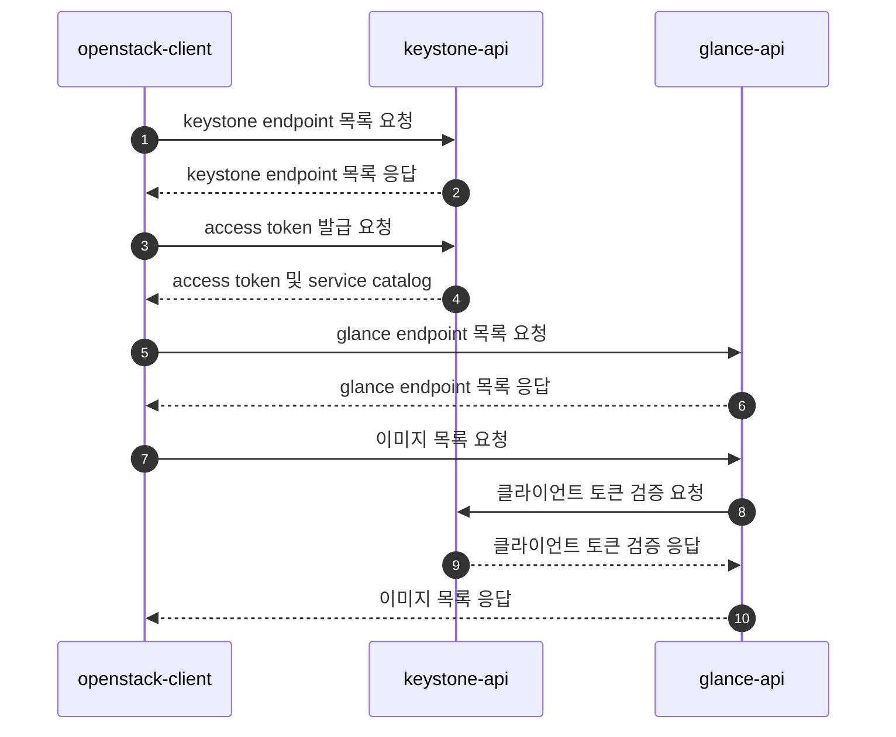

# Debugging python-openstackclient on local-machine with python venv

이 문서에서는 local 환경(`windows 10`)에서 python 가상환경을 이용하여 python-openstackclient를 디버깅하는 환경을 구성하는 방법을 알아보고,
각 openstack client의 API 요청에 대해 request / response를 로그 파일로 덤프하는 과정을 수행해 본다.  
기본 환경 구성은 [Debugging python-openstackclient](./python-openstackclient.md)와 동일하다.

!!! note
    로컬머신에 `python` 및 `pip`, `venv` 등은 설치되어 있다고 가정한다. (현재 환경은 `python-3.11.0`)

!!! note
    오픈스택이 설치되어 있는 remote host는 HOST_IP가 Public IP로 설치되어, 각 API EndPoint가 Public IP로 등록되어 있고, 외부에서 접속할 수 있다고 전제한다. (보안 그룹 설정에서 PORT 설정 필요할 수 있음)
    
    ``` cmd title="loopback interface에 public ip 추가"
    ubuntu@devstack-for-debug:~# ip addr add 182.161.114.101/32 dev lo
    ubuntu@devstack-for-debug:~$ ip a
    1: lo: <LOOPBACK,UP,LOWER_UP> mtu 65536 qdisc noqueue state UNKNOWN group default qlen 1000
        link/loopback 00:00:00:00:00:00 brd 00:00:00:00:00:00
        inet 127.0.0.1/8 scope host lo
           valid_lft forever preferred_lft forever
        inet 182.161.114.101/32 scope global lo
           valid_lft forever preferred_lft forever
        inet6 ::1/128 scope host
           valid_lft forever preferred_lft forever

        ubuntu@devstack-for-debug:~$
        ...
    ```

## python 가상 환경 생성

``` cmd title="venv 생성"
D:\.venv>python -m venv python-openstackclient
D:\.venv>cd python-openstackclient
D:\.venv>scripts\activate
(python-openstackclient) D:\.venv\python-openstackclient>
```

## python-openstackclient 설치

``` cmd title="python-openstackclient 설치"
(python-openstackclient) D:\.venv\python-openstackclient>pip install python-openstackclient
...
Successfully installed keystoneauth1-5.1.0 openstacksdk-0.103.0 osc-lib-2.6.2 oslo.config-9.0.0 \
oslo.i18n-5.1.0 oslo.serialization-5.0.0 oslo.utils-6.1.0 python-cinderclient-9.1.0 \
python-keystoneclient-5.0.1 python-novaclient-18.2.0 python-openstackclient-6.0.0 requests-2.28.1 (생략...)
(python-openstackclient) D:\.venv\python-openstackclient>dir lib\site-packages\openstackclient
 D 드라이브의 볼륨: DATA
 볼륨 일련 번호: 1AF4-B508

 D:\.venv\python-openstackclient\lib\site-packages\openstackclient 디렉터리

2022-12-06  오후 03:30    <DIR>          .
2022-12-06  오후 03:30    <DIR>          ..
2022-12-06  오후 03:30    <DIR>          api
2022-12-06  오후 03:30    <DIR>          common
2022-12-06  오후 03:30    <DIR>          compute
2022-12-06  오후 03:30               791 i18n.py
2022-12-06  오후 03:30    <DIR>          identity
2022-12-06  오후 03:30    <DIR>          image
2022-12-06  오후 03:30    <DIR>          locale
2022-12-06  오후 03:30    <DIR>          network
2022-12-06  오후 03:30    <DIR>          object
2022-12-06  오후 03:30             5,488 shell.py
2022-12-06  오후 03:30    <DIR>          tests
2022-12-06  오후 03:30    <DIR>          volume
2022-12-06  오후 03:30               777 __init__.py
2022-12-06  오후 03:30    <DIR>          __pycache__
               3개 파일               7,056 바이트
              13개 디렉터리  1,982,702,985,216 바이트 남음

(python-openstackclient) D:\.venv\python-openstackclient>
```
`python-troveclient`, `python-swiftclient` 등도 설치할 수 있다.

## Visual Studio Code 실행

가상환경 루트 경로(이 경우는 `D:\.venv\python-openstackclient`)에서 vscode를 실행한다. (혹은 폴더를 연다)
``` cmd title=""
(python-openstackclient) D:\.venv\python-openstackclient>code .
```


커맨드 팔레트를 열어 `Python: Select Interpreter` 커맨드를 실행한다.


## launch.json 파일 구성

``` json title=".vscode/launch.json"
{
    // Use IntelliSense to learn about possible attributes.
    // Hover to view descriptions of existing attributes.
    // For more information, visit: https://go.microsoft.com/fwlink/?linkid=830387
    "version": "0.2.0",
    "configurations": [
        {
            "name": "Python: openstack",    // 구성 이름
            "type": "python",
            "request": "launch",
            "program": "Scripts/openstack.exe", // 오픈스택 클라이언트 실행 파일 경로
            "args": ["database", "instance", "list", "-f", "json", "--all"], // 커맨드 인자
            // 환경 설정
            "env": {
                "OS_AUTH_URL": "http://devstack-debug/identity/v3",
                "OS_IDENTITY_API_VERSION": "3",
                "OS_USERNAME": "admin",
                "OS_PASSWORD": "asdf",
                "OS_PROJECT_NAME": "admin",
                "OS_USER_DOMAIN_NAME": "Default",
                "OS_PROJECT_DOMAIN_NAME": "Default"
            },
            "console": "integratedTerminal",
            "justMyCode": false
        }
    ]
}
```

## Set Break Point on Entry Point
`scripts/openstack.exe`가 실행되면 `Lib/site-packages/openstackclient/shell.py` 의 `main()` 으로 진입한다.  
여기서 break point를 걸고, 디버깅을 시작하여 break point가 잘 걸리는 지 확인한다.


## requests package dump

Entry Point를 따라, 진입하면 모든 요청은 `requests` 패키지의 `adapters.py` 모듈의 `HTTPAdapter.send()`를 통해 API 요청을 보내고 응답을 받는다는 것을 알 수 있다. ( https 인 경우는 다른 아답터겠지만... )

### build requests-observer package
`HTTPAdapter.send()` 메소드를 래핑하여 request/response를 로그 파일로 출력하기 위해, requests-observer 패키지를 만들었다.

``` text title="requests-observer package"
D:\WORKS\REQUESTS-OBSERVER
│  LICENSE
│  main.py
│  README.md
│  setup.py
│
└─requestsObserver
        observer.py
        __init__.py
```

``` python title="setup.py"
import setuptools

with open("README.md", "r") as fh:
    long_description = fh.read()

setuptools.setup(
    name='requestsObserver',
    version='0.0.1',
    author='jade-kinx',
    author_email='jade@kinx.net',
    description='tracing requests.response with decorator',
    long_description=long_description,
    long_description_content_type="text/markdown",
    url='https://github.com/jade-kinx/requestsObserver',
    packages=setuptools.find_packages(),
    classifiers=[
        "Programming Language :: Python :: 3",
        "License :: OSI Approved :: MIT License",
        "Operating System :: OS Independent",
    ],    
    python_requires='>=3.8',
)
```

``` python title="observer.py"
"""tracing requests.response for debugging ( only private studying purpose )"""

import os
import sys
from pathlib import Path
import platform
import logging
import textwrap
import json
from functools import wraps

# syslog exists?
try:
    import syslog
except:
    syslog = None

# request counter
req_idx = 0

# get log file path
# on linux: /var/log/requests-observer/request.log
# on windows: C:\Users\{UserId}\logs\requests.log on windows
def get_log_filepath():

    # create log path if not exists
    log_path = os.path.expanduser(os.path.join('~', "logs")) if platform.system() == 'Windows' else '/var/log/requests-observer'
    if not os.path.exists(log_path):
        os.mkdir(log_path)

    return os.path.join(log_path, "requests.log")

# print error message
def print_error(err):
    if syslog is not None:
        syslog.syslog(syslog.LOG_ERR, "requests-observer: {0}".format(err))
    else:
        logging.error("requests-observer: {0}".format(err))

# print log message
def print_log(message):

    # write log message
    with open(get_log_filepath(), "a") as logger:
        logger.write("{0}\n".format(message))

# observer decorator
def observe(f):
    @wraps(f)
    def decorator(*args, **kwargs):

        # original method call
        response = f(*args, **kwargs)

        # trace response
        try:
            # increment request counter
            global req_idx
            req_idx += 1

            # print log message
            print_log(format_response(response, req_idx))

        except Exception as ex:
            print_error(repr(ex))

        finally:
            # original response
            return response
    
    return decorator

# beautify json string with indent 2 space
def beautify_json(s):
    try:
        return json.dumps(json.loads(s), indent=2)
    except:
        return str(s)

# format requests.response
def format_response(response, seq):
    format_headers = lambda d: '\n'.join(f'{k}: {v}' for k, v in d.items())

    try:
        resp = response
        req = response.request

        # entry point name ( ex: openstack, glance-api, trove-api )
        ep = Path(sys.argv[0]).stem

        # parse response.body by content-type
        content_type = resp.headers.get('content-type')
        if not content_type:
            resp_body = resp.text
        elif 'json' in content_type:
            resp_body = beautify_json(resp.text)
        elif 'octet-stream' in content_type:
            resp_body = '<octet-stream> 0x{0}...'.format(''.join('{:02x}'.format(c) for c in resp.content[:32]))
        else:
            resp_body = resp.text

        return textwrap.dedent("""
            __{ep}__ -> Request [{seq}] {req.method} {req.url}
            {req_header}
            
            {req_body}

            __{ep}__ <- Response [{seq}] {resp.status_code} {resp.reason} {resp.url}
            {resp_header}
            
            {resp_body}
        """).format(
            ep = ep,
            seq = seq,
            resp = resp,
            req = req,
            req_header = format_headers(req.headers),
            resp_header = format_headers(resp.headers),
            req_body = beautify_json(req.body),
            resp_body = resp_body
        )
    except Exception as ex:
        return repr(ex)
```

``` cmd title="build package"
D:\works\requests-observer>python setup.py bdist_wheel
```
`dist\requestsObserver-*.whl` 패키지 파일이 빌드되었다. 가상환경 경로로 복사한다.


### Install requests-observer on venv
`python-openstackclient` venv 가 활성화 된 상태에서 빌드된 패키지를 설치한다.
``` cmd title="install requests-objserver"
(python-openstackclient) d:\.venv\python-openstackclient>pip install requestsObserver-0.0.1-py3-none-any.whl
Processing .\requestsobserver-0.0.1-py3-none-any.whl
Installing collected packages: requestsObserver
Successfully installed requestsObserver-0.0.1

(python-openstackclient) d:\.venv\python-openstackclient>
```


패키지가 잘 설치되었다.

### Wrapping on HTTPAdapter.send()

``` python title="Lib/site-packages/requests/adapters.py" hl_lines="2 3"
    # MODIFIED(jade-kinx): @observe for dump req/res
    from requestsObserver.observer import observe
    @observe
    def send(
        self, request, stream=False, timeout=None, verify=True, cert=None, proxies=None
    ):
    ...(생략)...    
```

이제 가상환경에서 openstack.exe 를 실행하면 사용자의 홈 디렉토리의 logs 폴더에 API 요청에 대한 로그 파일이 생성된다.

!!! note
    아래 로그와 시퀀스 다이어그램은 `devstack`이 설치된 우분투 환경에서 `openstack image list`를 실행한 결과이다

``` bash title=""
$ openstack image list
```

``` text title="/var/log/requests-observer/requests.log"

__openstack__ -> Request [1] GET http://182.161.114.101/identity
User-Agent: openstacksdk/0.101.0 keystoneauth1/5.0.0 python-requests/2.28.1 CPython/3.8.10
Accept-Encoding: gzip, deflate
Accept: application/json
Connection: keep-alive

None

__openstack__ <- Response [1] 300 MULTIPLE CHOICES http://182.161.114.101/identity
Date: Thu, 15 Dec 2022 09:23:40 GMT
Server: Apache/2.4.41 (Ubuntu)
Content-Type: application/json
Content-Length: 274
Location: http://182.161.114.101/identity/v3/
Vary: X-Auth-Token
x-openstack-request-id: req-0b9cef33-0236-4ef8-8952-248405aa88ac
Connection: close

{
  "versions": {
    "values": [
      {
        "id": "v3.14",
        "status": "stable",
        "updated": "2020-04-07T00:00:00Z",
        "links": [
          {
            "rel": "self",
            "href": "http://182.161.114.101/identity/v3/"
          }
        ],
        "media-types": [
          {
            "base": "application/json",
            "type": "application/vnd.openstack.identity-v3+json"
          }
        ]
      }
    ]
  }
}


__openstack__ -> Request [2] POST http://182.161.114.101/identity/v3/auth/tokens
User-Agent: openstacksdk/0.101.0 keystoneauth1/5.0.0 python-requests/2.28.1 CPython/3.8.10
Accept-Encoding: gzip, deflate
Accept: application/json
Connection: keep-alive
Content-Type: application/json
Content-Length: 209

{
  "auth": {
    "identity": {
      "methods": [
        "password"
      ],
      "password": {
        "user": {
          "password": "asdf",
          "name": "admin",
          "domain": {
            "id": "default"
          }
        }
      }
    },
    "scope": {
      "project": {
        "name": "admin",
        "domain": {
          "id": "default"
        }
      }
    }
  }
}

__openstack__ <- Response [2] 201 CREATED http://182.161.114.101/identity/v3/auth/tokens
Date: Thu, 15 Dec 2022 09:23:40 GMT
Server: Apache/2.4.41 (Ubuntu)
Content-Type: application/json
Content-Length: 3952
X-Subject-Token: gAAAAABjmuecYFmRPQsVsMQG0ISfxCu8my-78UFyTsH3pvEyXoED6xdWFniwmGex1QGimVH2utjSxyxDJI9Rso6QFflEjaDgWoO3KzZ_8C3oVzpLp9nBxlPhn97YNn01BT7UFubQucRARWUGTdSXeLK_KqKAhy4080GkUXHIal2SUQcqhrhC1yA
Vary: X-Auth-Token
x-openstack-request-id: req-6ea1f0e1-7ffc-4640-83fb-71fd68c1b58e
Connection: close

{
  "token": {
    "methods": [
      "password"
    ],
    "user": {
      "domain": {
        "id": "default",
        "name": "Default"
      },
      "id": "8221f17fbf934d309ba96cf2218be3ff",
      "name": "admin",
      "password_expires_at": null
    },
    "audit_ids": [
      "gU0UDl2MSOeHLxUg2DBN0A"
    ],
    "expires_at": "2022-12-15T12:23:40.000000Z",
    "issued_at": "2022-12-15T09:23:40.000000Z",
    "project": {
      "domain": {
        "id": "default",
        "name": "Default"
      },
      "id": "a5362cbd04fd4783a038d5a342d58e87",
      "name": "admin"
    },
    "is_domain": false,
    "roles": [
      {
        "id": "9ec297ce89234ce6bf2813e5e0166e4d",
        "name": "member"
      },
      {
        "id": "dbf0266266eb4ea885528545e3eb59ec",
        "name": "reader"
      },
      {
        "id": "89efad03325b4fb9a021bd88e534bbad",
        "name": "admin"
      }
    ],
    "catalog": [
      {
        "endpoints": [
          {
            "id": "06b2a46d96e349d08631686ab53d7e83",
            "interface": "public",
            "region_id": "RegionOne",
            "url": "http://182.161.114.101/compute/v2/a5362cbd04fd4783a038d5a342d58e87",
            "region": "RegionOne"
          }
        ],
        "id": "1ca87647ab754599b632a643e5b02c7c",
        "type": "compute_legacy",
        "name": "nova_legacy"
      },
      {
        "endpoints": [
          {
            "id": "254257a27e574069b9510cc4f218afa1",
            "interface": "public",
            "region_id": "RegionOne",
            "url": "http://182.161.114.101/identity",
            "region": "RegionOne"
          }
        ],
        "id": "2241c852ef204ee5bd4f4092ae9b5c7d",
        "type": "identity",
        "name": "keystone"
      },
      {
        "endpoints": [
          {
            "id": "a49d989ec6dd4e8f9399cf8a5caf519b",
            "interface": "public",
            "region_id": "RegionOne",
            "url": "http://182.161.114.101/volume/v3/a5362cbd04fd4783a038d5a342d58e87",
            "region": "RegionOne"
          }
        ],
        "id": "2baac711c03b4da1abaabe4e0f0f3575",
        "type": "volumev3",
        "name": "cinderv3"
      },
      {
        "endpoints": [
          {
            "id": "3195d06aa49541009838146ab9072997",
            "interface": "public",
            "region_id": "RegionOne",
            "url": "http://182.161.114.101/image",
            "region": "RegionOne"
          }
        ],
        "id": "4134c089d54f40c4bff6629c9b3c8b17",
        "type": "image",
        "name": "glance"
      },
      {
        "endpoints": [
          {
            "id": "be657c3c268e49c08bb0d31aa7b79b01",
            "interface": "public",
            "region_id": "RegionOne",
            "url": "http://182.161.114.101:9696/networking",
            "region": "RegionOne"
          }
        ],
        "id": "59d326ea519d4ad58dcc784330c372a4",
        "type": "network",
        "name": "neutron"
      },
      {
        "endpoints": [
          {
            "id": "64319e2274594aca8b7ff17be26f1306",
            "interface": "admin",
            "region_id": "RegionOne",
            "url": "http://182.161.114.101:8080",
            "region": "RegionOne"
          },
          {
            "id": "721a5750cf0448729c85f21749859ec0",
            "interface": "public",
            "region_id": "RegionOne",
            "url": "http://182.161.114.101:8080/v1/AUTH_a5362cbd04fd4783a038d5a342d58e87",
            "region": "RegionOne"
          }
        ],
        "id": "5b4f3dd567054612914e94f37e396d05",
        "type": "object-store",
        "name": "swift"
      },
      {
        "endpoints": [
          {
            "id": "dac7532e7f2547d59c42be1309388076",
            "interface": "public",
            "region_id": "RegionOne",
            "url": "http://182.161.114.101/placement",
            "region": "RegionOne"
          }
        ],
        "id": "5f8648439aa0443588164675566362a4",
        "type": "placement",
        "name": "placement"
      },
      {
        "endpoints": [
          {
            "id": "0d3a0c91848845ddb1794791ceeed1db",
            "interface": "public",
            "region_id": "RegionOne",
            "url": "http://182.161.114.101:8779/v1.0/a5362cbd04fd4783a038d5a342d58e87",
            "region": "RegionOne"
          },
          {
            "id": "d4e369995c8847d9aaeeab1824dc3a02",
            "interface": "admin",
            "region_id": "RegionOne",
            "url": "http://182.161.114.101:8779/v1.0/a5362cbd04fd4783a038d5a342d58e87",
            "region": "RegionOne"
          },
          {
            "id": "de625690480c40878f484c10f0cc21c3",
            "interface": "internal",
            "region_id": "RegionOne",
            "url": "http://182.161.114.101:8779/v1.0/a5362cbd04fd4783a038d5a342d58e87",
            "region": "RegionOne"
          }
        ],
        "id": "985cf9347e11431bbbc8640d3c73e064",
        "type": "database",
        "name": "trove"
      },
      {
        "endpoints": [
          {
            "id": "ce7d3f34c48d4c1a877222ca8403bcbc",
            "interface": "public",
            "region_id": "RegionOne",
            "url": "http://182.161.114.101/volume/v3/a5362cbd04fd4783a038d5a342d58e87",
            "region": "RegionOne"
          }
        ],
        "id": "ec5120d847b7457485bbbafc555df0af",
        "type": "block-storage",
        "name": "cinder"
      },
      {
        "endpoints": [
          {
            "id": "82bfd276ae734c3788bc66159b0c6d39",
            "interface": "public",
            "region_id": "RegionOne",
            "url": "http://182.161.114.101/compute/v2.1",
            "region": "RegionOne"
          }
        ],
        "id": "fa5e4dfaffbe476c88be86bbc10f092e",
        "type": "compute",
        "name": "nova"
      }
    ]
  }
}


__openstack__ -> Request [3] GET http://182.161.114.101/image
User-Agent: openstacksdk/0.101.0 keystoneauth1/5.0.0 python-requests/2.28.1 CPython/3.8.10
Accept-Encoding: gzip, deflate
Accept: application/json
Connection: keep-alive

None

__openstack__ <- Response [3] 300 Multiple Choices http://182.161.114.101/image
Date: Thu, 15 Dec 2022 09:23:41 GMT
Server: Apache/2.4.41 (Ubuntu)
Content-Type: application/json
Content-Length: 1347
Connection: close

{
  "versions": [
    {
      "id": "v2.16",
      "status": "CURRENT",
      "links": [
        {
          "rel": "self",
          "href": "http://182.161.114.101/image/v2/"
        }
      ]
    },
    {
      "id": "v2.15",
      "status": "SUPPORTED",
      "links": [
        {
          "rel": "self",
          "href": "http://182.161.114.101/image/v2/"
        }
      ]
    },
    {
      "id": "v2.14",
      "status": "SUPPORTED",
      "links": [
        {
          "rel": "self",
          "href": "http://182.161.114.101/image/v2/"
        }
      ]
    },
    {
      "id": "v2.9",
      "status": "SUPPORTED",
      "links": [
        {
          "rel": "self",
          "href": "http://182.161.114.101/image/v2/"
        }
      ]
    },
    {
      "id": "v2.7",
      "status": "SUPPORTED",
      "links": [
        {
          "rel": "self",
          "href": "http://182.161.114.101/image/v2/"
        }
      ]
    },
    {
      "id": "v2.6",
      "status": "SUPPORTED",
      "links": [
        {
          "rel": "self",
          "href": "http://182.161.114.101/image/v2/"
        }
      ]
    },
    {
      "id": "v2.5",
      "status": "SUPPORTED",
      "links": [
        {
          "rel": "self",
          "href": "http://182.161.114.101/image/v2/"
        }
      ]
    },
    {
      "id": "v2.4",
      "status": "SUPPORTED",
      "links": [
        {
          "rel": "self",
          "href": "http://182.161.114.101/image/v2/"
        }
      ]
    },
    {
      "id": "v2.3",
      "status": "SUPPORTED",
      "links": [
        {
          "rel": "self",
          "href": "http://182.161.114.101/image/v2/"
        }
      ]
    },
    {
      "id": "v2.2",
      "status": "SUPPORTED",
      "links": [
        {
          "rel": "self",
          "href": "http://182.161.114.101/image/v2/"
        }
      ]
    },
    {
      "id": "v2.1",
      "status": "SUPPORTED",
      "links": [
        {
          "rel": "self",
          "href": "http://182.161.114.101/image/v2/"
        }
      ]
    },
    {
      "id": "v2.0",
      "status": "SUPPORTED",
      "links": [
        {
          "rel": "self",
          "href": "http://182.161.114.101/image/v2/"
        }
      ]
    }
  ]
}


__glance-api__ -> Request [4] GET http://182.161.114.101/identity/v3/auth/tokens
User-Agent: python-keystoneclient
Accept-Encoding: gzip, deflate
Accept: application/json
Connection: keep-alive
X-Subject-Token: gAAAAABjmuecYFmRPQsVsMQG0ISfxCu8my-78UFyTsH3pvEyXoED6xdWFniwmGex1QGimVH2utjSxyxDJI9Rso6QFflEjaDgWoO3KzZ_8C3oVzpLp9nBxlPhn97YNn01BT7UFubQucRARWUGTdSXeLK_KqKAhy4080GkUXHIal2SUQcqhrhC1yA
OpenStack-Identity-Access-Rules: 1
X-Auth-Token: gAAAAABjmuI-z7IINEe2nD9Ekm2B_uSPktIkGnwWwMU40ulNziBvPCEqdSoCKM-DjHxIM_-ph6Qfc6kldbn0a7EQDcfUTp7VLw68MKEleCNuwNI3IAid89k1r6VUPev0X61hu-xB5ihRZZFiwiC8tSleEO8O07mKRQOMt8rRfCHjiYR2VZ-uMHU

None

__glance-api__ <- Response [4] 200 OK http://182.161.114.101/identity/v3/auth/tokens
Date: Thu, 15 Dec 2022 09:23:41 GMT
Server: Apache/2.4.41 (Ubuntu)
Content-Type: application/json
Content-Length: 3952
X-Subject-Token: gAAAAABjmuecYFmRPQsVsMQG0ISfxCu8my-78UFyTsH3pvEyXoED6xdWFniwmGex1QGimVH2utjSxyxDJI9Rso6QFflEjaDgWoO3KzZ_8C3oVzpLp9nBxlPhn97YNn01BT7UFubQucRARWUGTdSXeLK_KqKAhy4080GkUXHIal2SUQcqhrhC1yA
Vary: X-Auth-Token
x-openstack-request-id: req-5cf38014-99f6-4134-87f9-e8a52191e5d3
Connection: close

{
  "token": {
    "methods": [
      "password"
    ],
    "user": {
      "domain": {
        "id": "default",
        "name": "Default"
      },
      "id": "8221f17fbf934d309ba96cf2218be3ff",
      "name": "admin",
      "password_expires_at": null
    },
    "audit_ids": [
      "gU0UDl2MSOeHLxUg2DBN0A"
    ],
    "expires_at": "2022-12-15T12:23:40.000000Z",
    "issued_at": "2022-12-15T09:23:40.000000Z",
    "project": {
      "domain": {
        "id": "default",
        "name": "Default"
      },
      "id": "a5362cbd04fd4783a038d5a342d58e87",
      "name": "admin"
    },
    "is_domain": false,
    "roles": [
      {
        "id": "9ec297ce89234ce6bf2813e5e0166e4d",
        "name": "member"
      },
      {
        "id": "dbf0266266eb4ea885528545e3eb59ec",
        "name": "reader"
      },
      {
        "id": "89efad03325b4fb9a021bd88e534bbad",
        "name": "admin"
      }
    ],
    "catalog": [
      {
        "endpoints": [
          {
            "id": "06b2a46d96e349d08631686ab53d7e83",
            "interface": "public",
            "region_id": "RegionOne",
            "url": "http://182.161.114.101/compute/v2/a5362cbd04fd4783a038d5a342d58e87",
            "region": "RegionOne"
          }
        ],
        "id": "1ca87647ab754599b632a643e5b02c7c",
        "type": "compute_legacy",
        "name": "nova_legacy"
      },
      {
        "endpoints": [
          {
            "id": "254257a27e574069b9510cc4f218afa1",
            "interface": "public",
            "region_id": "RegionOne",
            "url": "http://182.161.114.101/identity",
            "region": "RegionOne"
          }
        ],
        "id": "2241c852ef204ee5bd4f4092ae9b5c7d",
        "type": "identity",
        "name": "keystone"
      },
      {
        "endpoints": [
          {
            "id": "a49d989ec6dd4e8f9399cf8a5caf519b",
            "interface": "public",
            "region_id": "RegionOne",
            "url": "http://182.161.114.101/volume/v3/a5362cbd04fd4783a038d5a342d58e87",
            "region": "RegionOne"
          }
        ],
        "id": "2baac711c03b4da1abaabe4e0f0f3575",
        "type": "volumev3",
        "name": "cinderv3"
      },
      {
        "endpoints": [
          {
            "id": "3195d06aa49541009838146ab9072997",
            "interface": "public",
            "region_id": "RegionOne",
            "url": "http://182.161.114.101/image",
            "region": "RegionOne"
          }
        ],
        "id": "4134c089d54f40c4bff6629c9b3c8b17",
        "type": "image",
        "name": "glance"
      },
      {
        "endpoints": [
          {
            "id": "be657c3c268e49c08bb0d31aa7b79b01",
            "interface": "public",
            "region_id": "RegionOne",
            "url": "http://182.161.114.101:9696/networking",
            "region": "RegionOne"
          }
        ],
        "id": "59d326ea519d4ad58dcc784330c372a4",
        "type": "network",
        "name": "neutron"
      },
      {
        "endpoints": [
          {
            "id": "64319e2274594aca8b7ff17be26f1306",
            "interface": "admin",
            "region_id": "RegionOne",
            "url": "http://182.161.114.101:8080",
            "region": "RegionOne"
          },
          {
            "id": "721a5750cf0448729c85f21749859ec0",
            "interface": "public",
            "region_id": "RegionOne",
            "url": "http://182.161.114.101:8080/v1/AUTH_a5362cbd04fd4783a038d5a342d58e87",
            "region": "RegionOne"
          }
        ],
        "id": "5b4f3dd567054612914e94f37e396d05",
        "type": "object-store",
        "name": "swift"
      },
      {
        "endpoints": [
          {
            "id": "dac7532e7f2547d59c42be1309388076",
            "interface": "public",
            "region_id": "RegionOne",
            "url": "http://182.161.114.101/placement",
            "region": "RegionOne"
          }
        ],
        "id": "5f8648439aa0443588164675566362a4",
        "type": "placement",
        "name": "placement"
      },
      {
        "endpoints": [
          {
            "id": "0d3a0c91848845ddb1794791ceeed1db",
            "interface": "public",
            "region_id": "RegionOne",
            "url": "http://182.161.114.101:8779/v1.0/a5362cbd04fd4783a038d5a342d58e87",
            "region": "RegionOne"
          },
          {
            "id": "d4e369995c8847d9aaeeab1824dc3a02",
            "interface": "admin",
            "region_id": "RegionOne",
            "url": "http://182.161.114.101:8779/v1.0/a5362cbd04fd4783a038d5a342d58e87",
            "region": "RegionOne"
          },
          {
            "id": "de625690480c40878f484c10f0cc21c3",
            "interface": "internal",
            "region_id": "RegionOne",
            "url": "http://182.161.114.101:8779/v1.0/a5362cbd04fd4783a038d5a342d58e87",
            "region": "RegionOne"
          }
        ],
        "id": "985cf9347e11431bbbc8640d3c73e064",
        "type": "database",
        "name": "trove"
      },
      {
        "endpoints": [
          {
            "id": "ce7d3f34c48d4c1a877222ca8403bcbc",
            "interface": "public",
            "region_id": "RegionOne",
            "url": "http://182.161.114.101/volume/v3/a5362cbd04fd4783a038d5a342d58e87",
            "region": "RegionOne"
          }
        ],
        "id": "ec5120d847b7457485bbbafc555df0af",
        "type": "block-storage",
        "name": "cinder"
      },
      {
        "endpoints": [
          {
            "id": "82bfd276ae734c3788bc66159b0c6d39",
            "interface": "public",
            "region_id": "RegionOne",
            "url": "http://182.161.114.101/compute/v2.1",
            "region": "RegionOne"
          }
        ],
        "id": "fa5e4dfaffbe476c88be86bbc10f092e",
        "type": "compute",
        "name": "nova"
      }
    ]
  }
}


__openstack__ -> Request [4] GET http://182.161.114.101/image/v2/images
User-Agent: openstacksdk/0.101.0 keystoneauth1/5.0.0 python-requests/2.28.1 CPython/3.8.10
Accept-Encoding: gzip, deflate
Accept: application/json
Connection: keep-alive
X-Auth-Token: gAAAAABjmuecYFmRPQsVsMQG0ISfxCu8my-78UFyTsH3pvEyXoED6xdWFniwmGex1QGimVH2utjSxyxDJI9Rso6QFflEjaDgWoO3KzZ_8C3oVzpLp9nBxlPhn97YNn01BT7UFubQucRARWUGTdSXeLK_KqKAhy4080GkUXHIal2SUQcqhrhC1yA

None

__openstack__ <- Response [4] 200 OK http://182.161.114.101/image/v2/images
Date: Thu, 15 Dec 2022 09:23:41 GMT
Server: Apache/2.4.41 (Ubuntu)
Content-Length: 2985
Content-Type: application/json
X-Openstack-Request-Id: req-3e68af9b-78b8-4ae9-b068-a4afdc7b79c4
Connection: close

{
  "images": [
    {
      "owner_specified.openstack.md5": "",
      "owner_specified.openstack.object": "images/cirros-0.6.1-x86_64-disk",
      "owner_specified.openstack.sha256": "",
      "name": "cirros-0.6.1-x86_64-disk",
      "disk_format": "qcow2",
      "container_format": "bare",
      "visibility": "public",
      "size": 21233664,
      "virtual_size": 117440512,
      "status": "active",
      "checksum": "0c839612eb3f2469420f2ccae990827f",
      "protected": false,
      "min_ram": 0,
      "min_disk": 0,
      "owner": "d34b18d2e5934d7d84900220483ad8b7",
      "os_hidden": false,
      "os_hash_algo": "sha512",
      "os_hash_value": "df88bac2791254f68941229792539621516bd480aa3d6fe4c0ca16057393d024a4944d644959f323dc01a25e3417c0b581776ab3c8db8da542039f2a67230579",
      "id": "9faa6fd5-b254-4184-80c0-66b7c062315e",
      "created_at": "2022-12-13T08:35:27Z",
      "updated_at": "2022-12-14T07:13:16Z",
      "tags": [],
      "self": "/v2/images/9faa6fd5-b254-4184-80c0-66b7c062315e",
      "file": "/v2/images/9faa6fd5-b254-4184-80c0-66b7c062315e/file",
      "schema": "/v2/schemas/image"
    },
    {
      "hw_rng_model": "virtio",
      "owner_specified.openstack.md5": "",
      "owner_specified.openstack.object": "images/trove-guest-ubuntu-focal",
      "owner_specified.openstack.sha256": "",
      "name": "trove-guest-ubuntu-focal",
      "disk_format": "qcow2",
      "container_format": "bare",
      "visibility": "shared",
      "size": 1033043968,
      "virtual_size": 5368709120,
      "status": "active",
      "checksum": "a68f5d086d6dd6cbe341dee9911412c8",
      "protected": false,
      "min_ram": 0,
      "min_disk": 0,
      "owner": "3a16cadd069e4a70b95f71316ec6f3e8",
      "os_hidden": false,
      "os_hash_algo": "sha512",
      "os_hash_value": "50e0e621db571157f5962cefeb9181cf93e9007ff023dbac31d66bf5eb50d51ba53c5634d4dfaf78fbdba631413f0b81cc216d26640c2d540aeedb6a59b839b4",
      "id": "53713cd4-241d-4b87-8dee-7619615f05e3",
      "created_at": "2022-12-06T05:20:41Z",
      "updated_at": "2022-12-06T05:22:31Z",
      "tags": [
        "trove"
      ],
      "self": "/v2/images/53713cd4-241d-4b87-8dee-7619615f05e3",
      "file": "/v2/images/53713cd4-241d-4b87-8dee-7619615f05e3/file",
      "schema": "/v2/schemas/image"
    },
    {
      "hw_rng_model": "virtio",
      "owner_specified.openstack.md5": "",
      "owner_specified.openstack.object": "images/cirros-0.5.2-x86_64-disk",
      "owner_specified.openstack.sha256": "",
      "name": "cirros-0.5.2-x86_64-disk",
      "disk_format": "qcow2",
      "container_format": "bare",
      "visibility": "public",
      "size": 16300544,
      "virtual_size": 117440512,
      "status": "active",
      "checksum": "b874c39491a2377b8490f5f1e89761a4",
      "protected": false,
      "min_ram": 0,
      "min_disk": 0,
      "owner": "a5362cbd04fd4783a038d5a342d58e87",
      "os_hidden": false,
      "os_hash_algo": "sha512",
      "os_hash_value": "6b813aa46bb90b4da216a4d19376593fa3f4fc7e617f03a92b7fe11e9a3981cbe8f0959dbebe36225e5f53dc4492341a4863cac4ed1ee0909f3fc78ef9c3e869",
      "id": "9c31f2c6-f22c-440e-b670-d8d5a5cc0405",
      "created_at": "2022-12-06T04:47:33Z",
      "updated_at": "2022-12-13T02:32:48Z",
      "tags": [],
      "self": "/v2/images/9c31f2c6-f22c-440e-b670-d8d5a5cc0405",
      "file": "/v2/images/9c31f2c6-f22c-440e-b670-d8d5a5cc0405/file",
      "schema": "/v2/schemas/image"
    }
  ],
  "first": "/v2/images",
  "schema": "/v2/schemas/images"
}
```

`openstack image list` 커맨드를 실행했을 때의 로그 파일이다.  
이 로그 파일에 따른 API 요청 관계를 Diagram으로 표현하면 아래와 같다.



!!! note
    로그 파일에는 (7) 이미지 목록 요청이 (9) 클라이언트 토큰 검증 응답 후에 나오지만 로그 파일을 기록하는 시점 상의 문제이며, 실제로는 이미지 목록 요청을 받은 `glance-api`가 `keystone-api`로 사용자 토큰 검증을 요청하고 응답을 받은 후에, 최종적으로 이미지 목록을 응답한다.