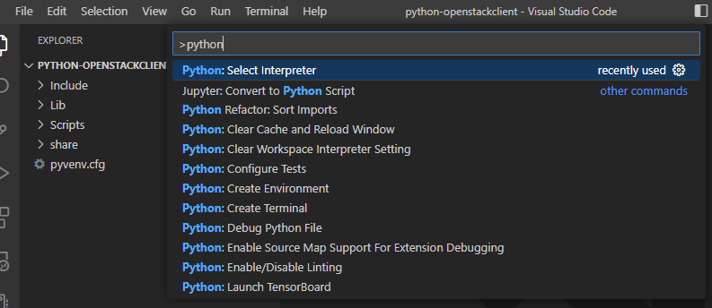
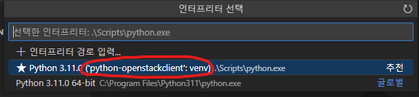
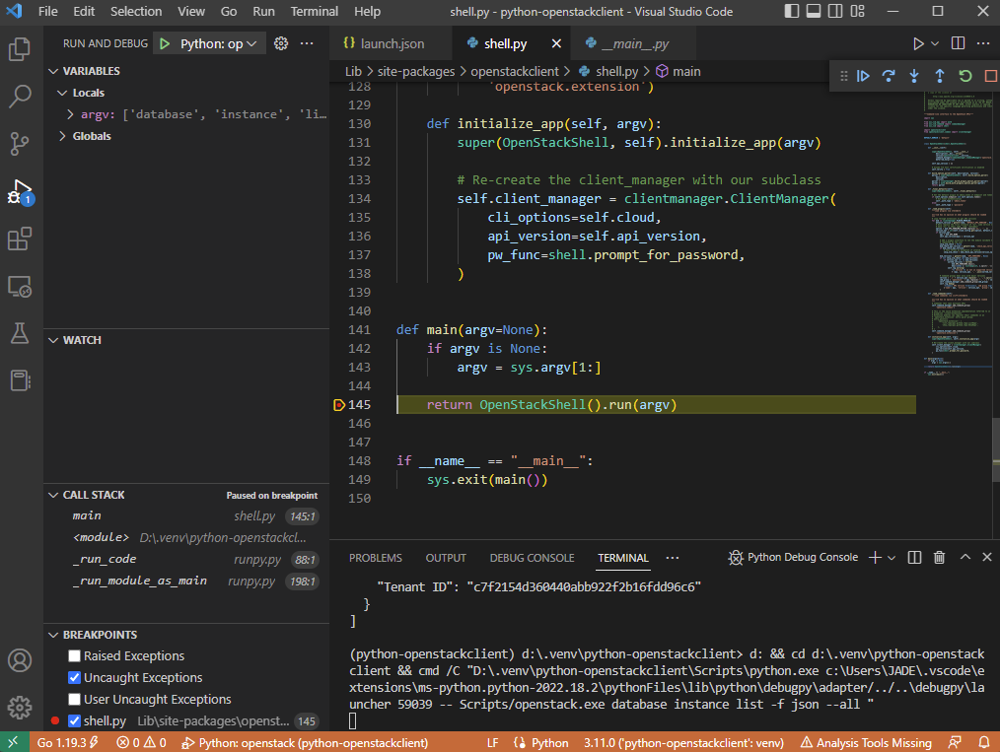
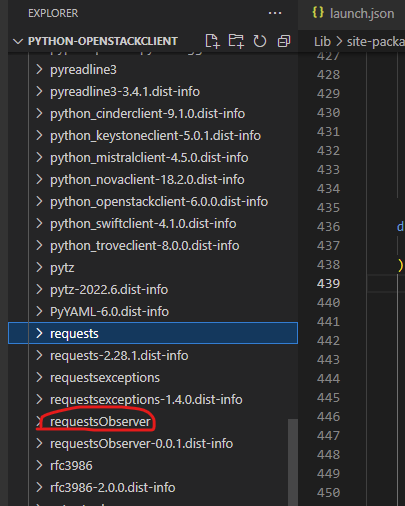
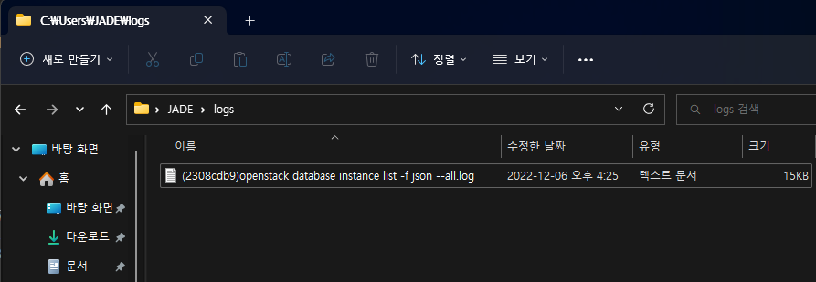
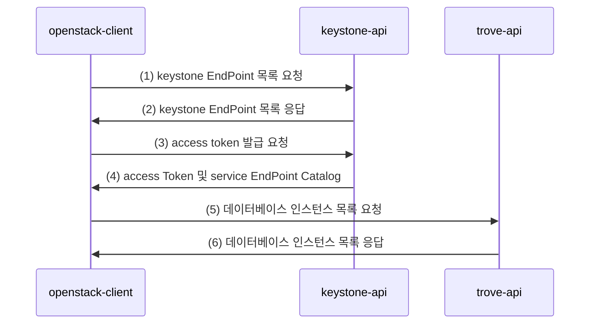

# Debugging python-openstackclient on local-machine with python venv

이 문서에서는 local 환경(`windows 10`)에서 python 가상환경을 이용하여 python-openstackclient를 디버깅하는 환경을 구성하는 방법을 알아보고,
각 openstack client의 API 요청에 대해 request / response를 로그 파일로 덤프하는 과정을 수행해 본다.  
기본 환경 구성은 [Debugging python-openstackclient](./python-openstackclient.md)와 동일하다.

!!! note
    로컬머신에 `python` 및 `pip`, `venv` 등은 설치되어 있다고 가정한다. (현재 환경은 `python-3.11.0`)

!!! note
    오픈스택이 설치되어 있는 remote host는 HOST_IP가 Public IP로 설치되어, 각 API EndPoint가 Public IP로 등록되어 있고, 외부에서 접속할 수 있다고 전제한다. (보안 그룹 설정에서 PORT 설정 필요할 수 있음)
    
    ``` cmd title="loopback interface에 public ip 추가"
    ubuntu@devstack-for-debug:~# ip addr add 182.161.114.101/32 dev lo
    ubuntu@devstack-for-debug:~$ ip a
    1: lo: <LOOPBACK,UP,LOWER_UP> mtu 65536 qdisc noqueue state UNKNOWN group default qlen 1000
        link/loopback 00:00:00:00:00:00 brd 00:00:00:00:00:00
        inet 127.0.0.1/8 scope host lo
           valid_lft forever preferred_lft forever
        inet 182.161.114.101/32 scope global lo
           valid_lft forever preferred_lft forever
        inet6 ::1/128 scope host
           valid_lft forever preferred_lft forever

        ubuntu@devstack-for-debug:~$
        ...
    ```

## python 가상 환경 생성

``` cmd title="venv 생성"
D:\.venv>python -m venv python-openstackclient
D:\.venv>cd python-openstackclient
D:\.venv>scripts\activate
(python-openstackclient) D:\.venv\python-openstackclient>
```

## python-openstackclient 설치

``` cmd title="python-openstackclient 설치"
(python-openstackclient) D:\.venv\python-openstackclient>pip install python-openstackclient
...
Successfully installed keystoneauth1-5.1.0 openstacksdk-0.103.0 osc-lib-2.6.2 oslo.config-9.0.0 \
oslo.i18n-5.1.0 oslo.serialization-5.0.0 oslo.utils-6.1.0 python-cinderclient-9.1.0 \
python-keystoneclient-5.0.1 python-novaclient-18.2.0 python-openstackclient-6.0.0 requests-2.28.1 (생략...)
(python-openstackclient) D:\.venv\python-openstackclient>dir lib\site-packages\openstackclient
 D 드라이브의 볼륨: DATA
 볼륨 일련 번호: 1AF4-B508

 D:\.venv\python-openstackclient\lib\site-packages\openstackclient 디렉터리

2022-12-06  오후 03:30    <DIR>          .
2022-12-06  오후 03:30    <DIR>          ..
2022-12-06  오후 03:30    <DIR>          api
2022-12-06  오후 03:30    <DIR>          common
2022-12-06  오후 03:30    <DIR>          compute
2022-12-06  오후 03:30               791 i18n.py
2022-12-06  오후 03:30    <DIR>          identity
2022-12-06  오후 03:30    <DIR>          image
2022-12-06  오후 03:30    <DIR>          locale
2022-12-06  오후 03:30    <DIR>          network
2022-12-06  오후 03:30    <DIR>          object
2022-12-06  오후 03:30             5,488 shell.py
2022-12-06  오후 03:30    <DIR>          tests
2022-12-06  오후 03:30    <DIR>          volume
2022-12-06  오후 03:30               777 __init__.py
2022-12-06  오후 03:30    <DIR>          __pycache__
               3개 파일               7,056 바이트
              13개 디렉터리  1,982,702,985,216 바이트 남음

(python-openstackclient) D:\.venv\python-openstackclient>
```
`python-troveclient`, `python-swiftclient` 등도 설치할 수 있다.

## Visual Studio Code 실행

가상환경 루트 경로(이 경우는 `D:\.venv\python-openstackclient`)에서 vscode를 실행한다. (혹은 폴더를 연다)
``` cmd title=""
(python-openstackclient) D:\.venv\python-openstackclient>code .
```


커맨드 팔레트를 열어 `Python: Select Interpreter` 커맨드를 실행한다.



## launch.json 파일 구성

``` json title=".vscode/launch.json"
{
    // Use IntelliSense to learn about possible attributes.
    // Hover to view descriptions of existing attributes.
    // For more information, visit: https://go.microsoft.com/fwlink/?linkid=830387
    "version": "0.2.0",
    "configurations": [
        {
            "name": "Python: openstack",    // 구성 이름
            "type": "python",
            "request": "launch",
            "program": "Scripts/openstack.exe", // 오픈스택 클라이언트 실행 파일 경로
            "args": ["database", "instance", "list", "-f", "json", "--all"], // 커맨드 인자
            // 환경 설정
            "env": {
                "OS_AUTH_URL": "http://devstack-debug/identity/v3",
                "OS_IDENTITY_API_VERSION": "3",
                "OS_USERNAME": "admin",
                "OS_PASSWORD": "asdf",
                "OS_PROJECT_NAME": "admin",
                "OS_USER_DOMAIN_NAME": "Default",
                "OS_PROJECT_DOMAIN_NAME": "Default"
            },
            "console": "integratedTerminal",
            "justMyCode": false
        }
    ]
}
```

## Set Break Point on Entry Point
`scripts/openstack.exe`가 실행되면 `Lib/site-packages/openstackclient/shell.py` 의 `main()` 으로 진입한다.  
여기서 break point를 걸고, 디버깅을 시작하여 break point가 잘 걸리는 지 확인한다.



## requests package dump

Entry Point를 따라, 진입하면 모든 요청은 `requests` 패키지의 `adapters.py` 모듈의 `HTTPAdapter.send()`를 통해 API 요청을 보내고 응답을 받는다는 것을 알 수 있다. ( https 인 경우는 다른 아답터겠지만... )

### build requests-observer package
`HTTPAdapter.send()` 메소드를 래핑하여 request/response를 로그 파일로 출력하기 위해, requests-observer 패키지를 만들었다.

``` text title="requests-observer package"
D:\WORKS\REQUESTS-OBSERVER
│  LICENSE
│  main.py
│  README.md
│  setup.py
│
└─requestsObserver
        observer.py
        __init__.py
```

``` python title="setup.py"
import setuptools

with open("README.md", "r") as fh:
    long_description = fh.read()

setuptools.setup(
    name='requestsObserver',
    version='0.0.1',
    author='jade-kinx',
    author_email='jade@kinx.net',
    description='tracing requests.response with decorator',
    long_description=long_description,
    long_description_content_type="text/markdown",
    url='https://github.com/jade-kinx/requestsObserver',
    packages=setuptools.find_packages(),
    classifiers=[
        "Programming Language :: Python :: 3",
        "License :: OSI Approved :: MIT License",
        "Operating System :: OS Independent",
    ],    
    python_requires='>=3.8',
)
```

``` python title="observer.py"
import os
import sys
import logging
import uuid
import textwrap
import json
from functools import wraps
from pathlib import Path

# unique id of logger
UID = str(uuid.uuid1())[:8]

# request counter
req_counter = 0

# log path
log_path = os.path.expanduser(os.path.join('~', "logs"))
if not os.path.exists(log_path):
    os.mkdir(log_path)

# set logger
logger = logging.getLogger(UID)
logger.addHandler(logging.FileHandler("{path}/({uid}){exec} {args}.log".format(
    path=log_path, uid=UID, 
    exec=Path(sys.argv[0]).stem, 
    args=" ".join(sys.argv[1:])
    )))
logger.setLevel(logging.DEBUG)


# print log message
def print_log(message):
    logger.debug(message)

# observer decorator
def observe(f):
    @wraps(f)
    def decorator(*args, **kwargs):

        # original method call
        response = f(*args, **kwargs)

        # increment request counter
        global req_counter
        req_counter += 1

        # trace response
        try:
            # print log message
            print_log(format_response(response, req_counter))

        except Exception as ex:
            logging.exception(str(ex))

        # original response
        return response
    
    return decorator

# get formatted string of requests.response
def format_response(response, req_counter):
    format_headers = lambda d: '\n'.join(f'{k}: {v}' for k, v in d.items())

    req = response.request
    res = response

    return textwrap.dedent("""
        ----- REQUEST [{reqidx}] ------------------------------
        {req.method} {req.url}
        {reqhdrs}

        DATA={body}

        ----- RESPONSE [{reqidx}] -----------------------------
        {res.status_code} {res.reason} {res.url}
        {reshdrs}

        DATA={text}
        ----- END OF REQUEST [{reqidx}] -----------------------
        """).format(
            reqidx=req_counter,
            req=req, 
            res=res, 
            reqhdrs=format_headers(req.headers), 
            reshdrs=format_headers(res.headers), 
            body=beautify_json(req.body),
            text=beautify_json(res.text),
        )

# beautify json string
def beautify_json(data):
    if data is None:
        return '{}'

    try:
        return json.dumps(json.loads(data), indent=2)
    except:
        return str(data)
```

``` cmd title="build package"
D:\works\requests-observer>python setup.py bdist_wheel
```
`dist\requestsObserver-*.whl` 패키지 파일이 빌드되었다. 가상환경 경로로 복사한다.


### Install requests-observer on venv
`python-openstackclient` venv 가 활성화 된 상태에서 빌드된 패키지를 설치한다.
``` cmd title="install requests-objserver"
(python-openstackclient) d:\.venv\python-openstackclient>pip install requestsObserver-0.0.1-py3-none-any.whl
Processing .\requestsobserver-0.0.1-py3-none-any.whl
Installing collected packages: requestsObserver
Successfully installed requestsObserver-0.0.1

(python-openstackclient) d:\.venv\python-openstackclient>
```



패키지가 잘 설치되었다.

### Wrapping on HTTPAdapter.send()

``` python title="Lib/site-packages/requests/adapters.py" hl_lines="2 3"
    # MODIFIED(jade-kinx): @observe for dump req/res
    from requestsObserver.observer import observe
    @observe
    def send(
        self, request, stream=False, timeout=None, verify=True, cert=None, proxies=None
    ):
    ...(생략)...    
```

이제 가상환경에서 openstack.exe 를 실행하면 사용자의 홈 디렉토리의 logs 폴더에 API 요청에 대한 로그 파일이 생성된다.



``` text title=".log"

----- REQUEST [1] ------------------------------
GET http://devstack-zed/identity
User-Agent: openstacksdk/0.103.0 keystoneauth1/5.1.0 python-requests/2.28.1 CPython/3.11.0
Accept-Encoding: gzip, deflate
Accept: application/json
Connection: keep-alive

DATA={}

----- RESPONSE [1] -----------------------------
300 MULTIPLE CHOICES http://devstack-zed/identity
Date: Tue, 06 Dec 2022 07:42:38 GMT
Server: Apache/2.4.41 (Ubuntu)
Content-Type: application/json
Content-Length: 274
Location: http://182.161.114.200/identity/v3/
Vary: X-Auth-Token
x-openstack-request-id: req-54f62e8a-f548-463e-9da7-2ddca0ae445d
Connection: close

DATA={
  "versions": {
    "values": [
      {
        "id": "v3.14",
        "status": "stable",
        "updated": "2020-04-07T00:00:00Z",
        "links": [
          {
            "rel": "self",
            "href": "http://182.161.114.200/identity/v3/"
          }
        ],
        "media-types": [
          {
            "base": "application/json",
            "type": "application/vnd.openstack.identity-v3+json"
          }
        ]
      }
    ]
  }
}
----- END OF REQUEST [1] -----------------------


----- REQUEST [2] ------------------------------
POST http://devstack-zed/identity/v3/auth/tokens
User-Agent: openstacksdk/0.103.0 keystoneauth1/5.1.0 python-requests/2.28.1 CPython/3.11.0
Accept-Encoding: gzip, deflate
Accept: application/json
Connection: keep-alive
Content-Type: application/json
Content-Length: 213

DATA={
  "auth": {
    "identity": {
      "methods": [
        "password"
      ],
      "password": {
        "user": {
          "password": "asdf",
          "name": "admin",
          "domain": {
            "name": "Default"
          }
        }
      }
    },
    "scope": {
      "project": {
        "name": "admin",
        "domain": {
          "name": "Default"
        }
      }
    }
  }
}

----- RESPONSE [2] -----------------------------
201 CREATED http://devstack-zed/identity/v3/auth/tokens
Date: Tue, 06 Dec 2022 07:42:38 GMT
Server: Apache/2.4.41 (Ubuntu)
Content-Type: application/json
Content-Length: 3952
X-Subject-Token: gAAAAABjjvJvFithsEZSZWYsoXATzVpygYGj8VKeuH-lBIxC6lZucV2BboO2lLU13QKRg6DLwacsvLCpp-xqHd311C1YN9ESNXEREpy3jhGcsqrriIrm7bu7AKAARC9Tl337FzySxXDAnU-6pv5WXyc9lvjgQDNNNzJXubBX0AuTdFKfxLf8i2E
Vary: X-Auth-Token
x-openstack-request-id: req-c1d6c868-3d25-4565-a50d-489f4ac4f62f
Connection: close

DATA={
  "token": {
    "methods": [
      "password"
    ],
    "user": {
      "domain": {
        "id": "default",
        "name": "Default"
      },
      "id": "e128b83ac09e4f78abd0a65789e2376b",
      "name": "admin",
      "password_expires_at": null
    },
    "audit_ids": [
      "3_qA8wlkTNSyfSF9DWXUQQ"
    ],
    "expires_at": "2022-12-06T10:42:39.000000Z",
    "issued_at": "2022-12-06T07:42:39.000000Z",
    "project": {
      "domain": {
        "id": "default",
        "name": "Default"
      },
      "id": "c7f2154d360440abb922f2b16fdd96c6",
      "name": "admin"
    },
    "is_domain": false,
    "roles": [
      {
        "id": "536c34d179c740da8da1afdb78d5f6a3",
        "name": "reader"
      },
      {
        "id": "cf7c50f65e4c479283952a306931d5f6",
        "name": "member"
      },
      {
        "id": "d2fbbd096b134919b61a5cec28584213",
        "name": "admin"
      }
    ],
    "catalog": [
      {
        "endpoints": [
          {
            "id": "0df3ffa72a9d4eecb8532947a0ccfe6c",
            "interface": "public",
            "region_id": "RegionOne",
            "url": "http://182.161.114.200/volume/v3/c7f2154d360440abb922f2b16fdd96c6",
            "region": "RegionOne"
          }
        ],
        "id": "5b8ca1f50e9b49cfb97f390dba863409",
        "type": "block-storage",
        "name": "cinder"
      },
      {
        "endpoints": [
          {
            "id": "60b65ed57a5c45a5ba366b6e568f56b7",
            "interface": "public",
            "region_id": "RegionOne",
            "url": "http://182.161.114.200/compute/v2/c7f2154d360440abb922f2b16fdd96c6",
            "region": "RegionOne"
          }
        ],
        "id": "7d1c8a389bc14e8290ea123243f9464d",
        "type": "compute_legacy",
        "name": "nova_legacy"
      },
      {
        "endpoints": [
          {
            "id": "5301066c86694a1199d280a02e7779b1",
            "interface": "public",
            "region_id": "RegionOne",
            "url": "http://182.161.114.200/image",
            "region": "RegionOne"
          }
        ],
        "id": "8c0b78823bff49bebb862a71f7374210",
        "type": "image",
        "name": "glance"
      },
      {
        "endpoints": [
          {
            "id": "ea00c484dbd34f65b25644eb7b434275",
            "interface": "public",
            "region_id": "RegionOne",
            "url": "http://182.161.114.200/identity",
            "region": "RegionOne"
          }
        ],
        "id": "92367ef462ad444099a58fdf18ee3c9e",
        "type": "identity",
        "name": "keystone"
      },
      {
        "endpoints": [
          {
            "id": "85150c222ffe4ebe9984d495d2c7c63a",
            "interface": "public",
            "region_id": "RegionOne",
            "url": "http://182.161.114.200/placement",
            "region": "RegionOne"
          }
        ],
        "id": "98fd02ee808f42f898c1abaa4dd2cd80",
        "type": "placement",
        "name": "placement"
      },
      {
        "endpoints": [
          {
            "id": "9b20e57f012143fd840524df0c5b238d",
            "interface": "public",
            "region_id": "RegionOne",
            "url": "http://182.161.114.200/compute/v2.1",
            "region": "RegionOne"
          }
        ],
        "id": "a8ab86dce16643ffa9eae6e9c90347f8",
        "type": "compute",
        "name": "nova"
      },
      {
        "endpoints": [
          {
            "id": "02fbefaa51fb479e9f6cb893cb4899c6",
            "interface": "public",
            "region_id": "RegionOne",
            "url": "http://182.161.114.200:8779/v1.0/c7f2154d360440abb922f2b16fdd96c6",
            "region": "RegionOne"
          },
          {
            "id": "260b6f99ba374171b321adb2f45bb0e8",
            "interface": "admin",
            "region_id": "RegionOne",
            "url": "http://182.161.114.200:8779/v1.0/c7f2154d360440abb922f2b16fdd96c6",
            "region": "RegionOne"
          },
          {
            "id": "8a853656239042d39c61d505c329908b",
            "interface": "internal",
            "region_id": "RegionOne",
            "url": "http://182.161.114.200:8779/v1.0/c7f2154d360440abb922f2b16fdd96c6",
            "region": "RegionOne"
          }
        ],
        "id": "b3e07f2e55954e04806d42729b586292",
        "type": "database",
        "name": "trove"
      },
      {
        "endpoints": [
          {
            "id": "743a13b0b9284db080875ea036b4cda7",
            "interface": "public",
            "region_id": "RegionOne",
            "url": "http://182.161.114.200:9696/networking",
            "region": "RegionOne"
          }
        ],
        "id": "c676387f25de48ad8193740155820f21",
        "type": "network",
        "name": "neutron"
      },
      {
        "endpoints": [
          {
            "id": "705fce83fcce42dea7628db2bff7d995",
            "interface": "admin",
            "region_id": "RegionOne",
            "url": "http://182.161.114.200:8080",
            "region": "RegionOne"
          },
          {
            "id": "7a1461c2265a47feb314225f086d2d2f",
            "interface": "public",
            "region_id": "RegionOne",
            "url": "http://182.161.114.200:8080/v1/AUTH_c7f2154d360440abb922f2b16fdd96c6",
            "region": "RegionOne"
          }
        ],
        "id": "ecec68cc3a3b448b9716a5728be1dec5",
        "type": "object-store",
        "name": "swift"
      },
      {
        "endpoints": [
          {
            "id": "b241b0ea1ce0444e9014d2efe87ac46d",
            "interface": "public",
            "region_id": "RegionOne",
            "url": "http://182.161.114.200/volume/v3/c7f2154d360440abb922f2b16fdd96c6",
            "region": "RegionOne"
          }
        ],
        "id": "f3ceb4a56c9d4a699e7831f94ab2b9c7",
        "type": "volumev3",
        "name": "cinderv3"
      }
    ]
  }
}
----- END OF REQUEST [2] -----------------------


----- REQUEST [3] ------------------------------
GET http://182.161.114.200:8779/v1.0/c7f2154d360440abb922f2b16fdd96c6/instances?include_clustered=False
User-Agent: openstacksdk/0.103.0 keystoneauth1/5.1.0 python-requests/2.28.1 CPython/3.11.0
Accept-Encoding: gzip, deflate
Accept: application/json
Connection: keep-alive
X-Auth-Token: gAAAAABjjvJvFithsEZSZWYsoXATzVpygYGj8VKeuH-lBIxC6lZucV2BboO2lLU13QKRg6DLwacsvLCpp-xqHd311C1YN9ESNXEREpy3jhGcsqrriIrm7bu7AKAARC9Tl337FzySxXDAnU-6pv5WXyc9lvjgQDNNNzJXubBX0AuTdFKfxLf8i2E

DATA={}

----- RESPONSE [3] -----------------------------
200 OK http://182.161.114.200:8779/v1.0/c7f2154d360440abb922f2b16fdd96c6/instances?include_clustered=False
Date: Tue, 06 Dec 2022 07:42:39 GMT
Server: Apache/2.4.41 (Ubuntu)
Content-Length: 1086
Connection: close
Content-Type: application/json

DATA={
  "instances": [
    {
      "id": "02799d72-2389-4c8e-a4c6-970b6796a561",
      "name": "mydb",
      "status": "ACTIVE",
      "operating_status": "HEALTHY",
      "links": [
        {
          "href": "https://182.161.114.200:8779/v1.0/c7f2154d360440abb922f2b16fdd96c6/instances/02799d72-2389-4c8e-a4c6-970b6796a561",
          "rel": "self"
        },
        {
          "href": "https://182.161.114.200:8779/instances/02799d72-2389-4c8e-a4c6-970b6796a561",
          "rel": "bookmark"
        }
      ],
      "flavor": {
        "id": "77883c8b-9308-4635-820c-bb5ec25b1e26",
        "links": [
          {
            "href": "https://182.161.114.200:8779/v1.0/c7f2154d360440abb922f2b16fdd96c6/flavors/77883c8b-9308-4635-820c-bb5ec25b1e26",
            "rel": "self"
          },
          {
            "href": "https://182.161.114.200:8779/flavors/77883c8b-9308-4635-820c-bb5ec25b1e26",
            "rel": "bookmark"
          }
        ]
      },
      "datastore": {
        "type": "mysql",
        "version": "5.7.29"
      },
      "region": "RegionOne",
      "access": {
        "is_public": true
      },
      "tenant_id": "c7f2154d360440abb922f2b16fdd96c6",
      "volume": {
        "size": 1
      },
      "ip": [
        "10.10.0.15",
        "192.168.100.82"
      ],
      "addresses": [
        {
          "address": "10.10.0.15",
          "type": "private",
          "network": "a75a79d8-56b3-4cf6-a28d-4190d43a97bd"
        },
        {
          "address": "192.168.100.82",
          "type": "public"
        }
      ]
    }
  ]
}
----- END OF REQUEST [3] -----------------------

```

`openstack database instance list --format json --all` 커맨드를 실행했을 때의 로그 파일이다.  
로그 파일에 의하면, `openstack.exe`는 총 3번의 API CALL을 요청하고(keystone에 2번, trove-api에 1번),
이 관계를 Diagram으로 표현하면 아래와 같다.



