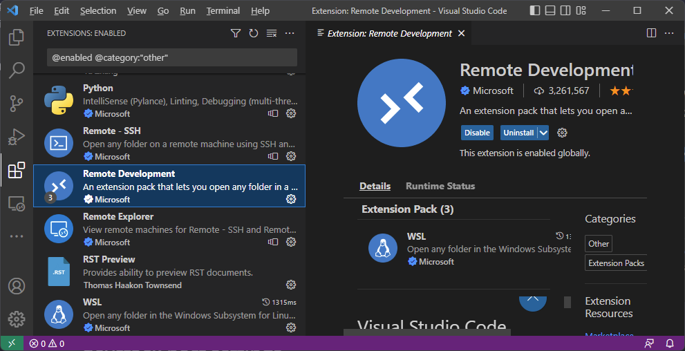
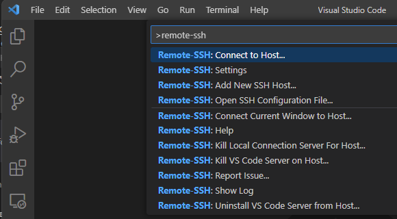
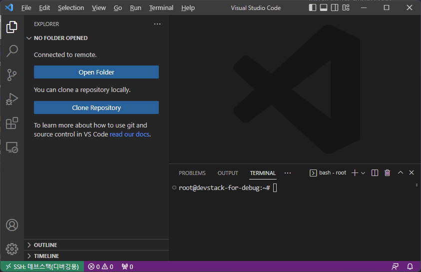
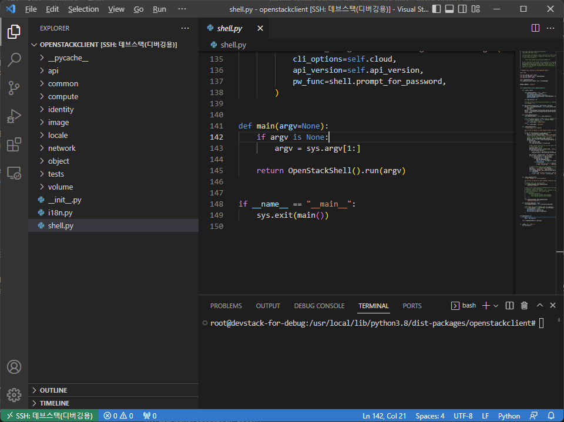
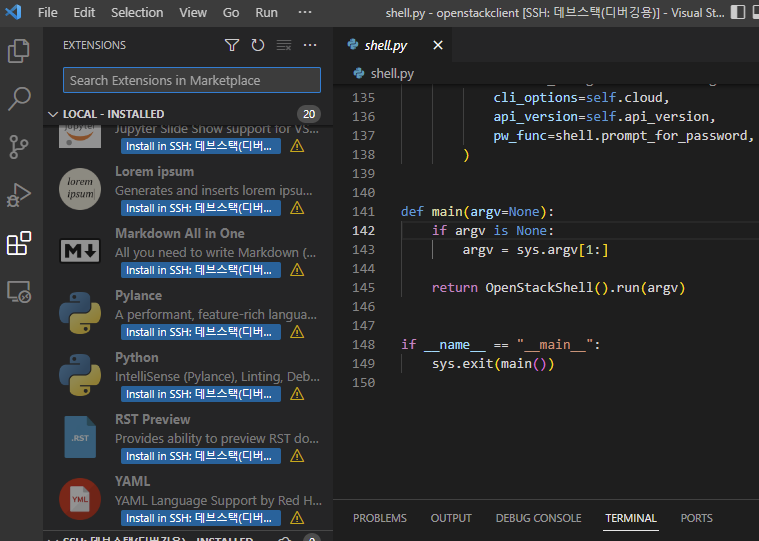
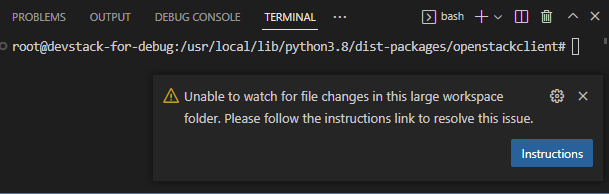
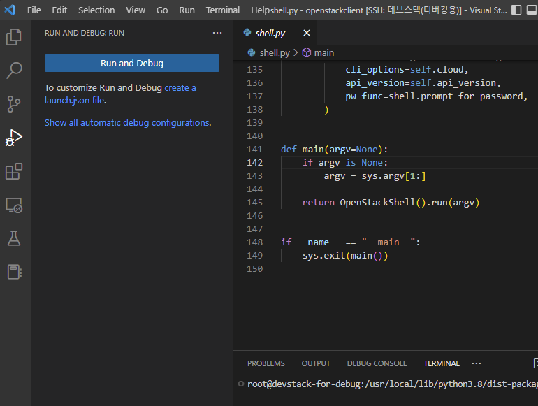
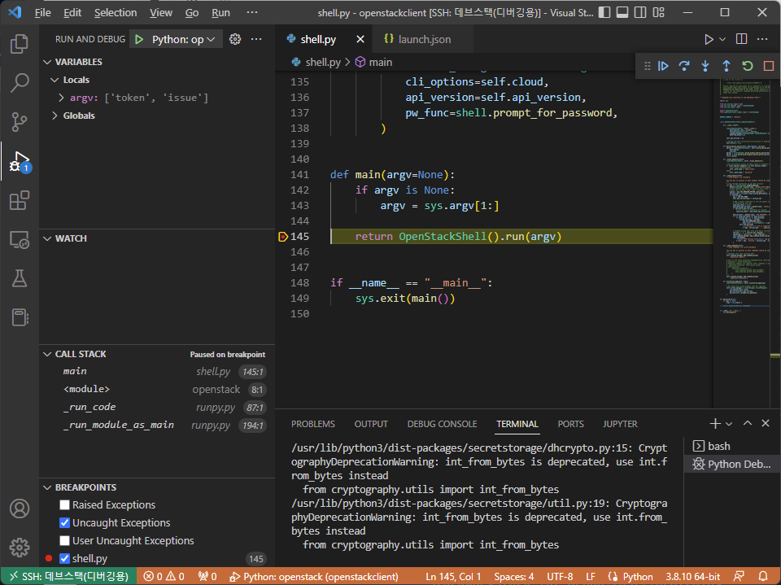

# Debugging python-openstackclient

이 문서는 `python-openstackclient`를 `visual studio code`에서 원격(또는 로컬)으로 디버깅하기 위한 환경 설정을 설명한다.

!!! note "Requirements"
    * Ubuntu-20.04 LTS
    * 4 Core, 8 GB RAM 이상 ( for DevStack/ZED )
    * DevStack ZED version basic Installed
    * Visual Studio Code

openstack client를 사용하는 계정은 `root`라고 가정한다. ( for python3-openstackclient source code access on remote host )

## Install Visual Studio Code Extension Package

`vscode` `Extensions` 탭에서 다음의 확장패키지를 설치한다.

* Remote Development
* Python



## Enable Root Login for SSH on Remote Host

`/etc/ssh/sshd_config` 파일의 `PermitRootLogin` 항목이 `prohibit-password` 등으로 설정되어 있다면, 주석처리하거나 `yes` 로 변경하고, `sshd`를 재시작해준다.
``` bash title="enable root ssh"
$ sudo vi /etc/ssh/sshd_config
...
#PermitRootLogin prohibit-password // 주석처리 또는 yes
...
$ sudo service sshd restart
```

`/root/.ssh/authorized_keys` 파일에 `ssh-key` 공개키 추가

!!! warning
    공개키에 `no-port-forwarding,no-agent-forwarding,no-X11-forwarding,command="echo 'Please login as the user \"ubuntu\" rather than the user \"root\".';echo;sleep 10"`가 있는 경우 제거

## Remote-SSH Host 구성 및 연결

`C:/Users/{UserId}/.ssh/config` 파일에 Remote Host 를 추가한다.
``` yaml title="C:/Users/Jade/.ssh/config"
# Read more about SSH config files: https://linux.die.net/man/5/ssh_config
Host 데브스택
    HostName devstack   # 호스트이름: C:/Windows/system32/drivers/etc/hosts 파일에 등록, IP도 가능
    User root           # Remote Host 사용자 계정(일반 사용자 계정 무방)
    IdentityFile C:/Users/Jade/.ssh/id_rsa  # SSH 비밀키(/root/.ssh/authorized_keys에 등록된 키와 Pair)

Host 데브스택(ZED)
    HostName devstack-zed
    User root
    IdentityFile C:/Users/Jade/.ssh/id_rsa       
```

`vscode`의 커맨드 팔레트를 열어(++ctrl+shift+p++ 또는 ++f1++) 아래 그림과 같이 `Remote-SSH: Connect to Host...` 를 선택하여, 접속하고자 하는 호스트를 선택하여 접속한다.



접속이 완료되면, 아래 그림과 같은 화면이 뜬다.


여기서 `Open Folder` 버튼을 클릭하여 시작하고자 하는 remote directory를 지정하여 프로젝트를 시작할 수 있다.  
여기서는 `python3-openstackclient`가 설치되어 있는 `/usr/local/lib/python3.8/dist-packages/openstackclient`를 연다.

프로젝트 폴더가 열리면 아래 그림과 같은 화면이 된다.


## Install VSCode Extension on Remote Host

`vscode` 좌측의 `extensions` 탭에서 아래 그림과 같이 remote host에 `Python` 확장팩을 설치한다. `install in SSH: ...`



!!! note
      
    `Unstable to watch for file changes in this large workspace folder.` 와 같은 경고 창이 발생하면, remote host의 `fs.inotify.max_user_watches` 설정을 변경해 준다. (참고: https://code.visualstudio.com/docs/setup/linux#_visual-studio-code-is-unable-to-watch-for-file-changes-in-this-large-workspace-error-enospc)

    ``` bash title="modify fs.inotify.max_user_watches"
    # cat /proc/sys/fs/inotify/max_user_watches
    8192
    # vi /etc/sysctl.conf
    fs.inotify.max_user_watches=524288 # append this line on end of file
    # sysctl -p
    fs.inotify.max_user_watches = 524288
    ```

## Start to debug...

`vscode`의 `Run and Debug` 탭에서 `create a launch.json file` 항목을 선택하여 `launch.json` 파일을 생성하고, 디버깅 환경을 구성한다.



``` json title=".vscode/launch.json"
{
    // Use IntelliSense to learn about possible attributes.
    // Hover to view descriptions of existing attributes.
    // For more information, visit: https://go.microsoft.com/fwlink/?linkid=830387
    "version": "0.2.0",
    "configurations": [
        {
            "name": "Python: openstack",
            "type": "python",
            "request": "launch",
            "program": "/usr/local/bin/openstack", // openstack 실행파일 경로
            "args": ["token", "issue"],  // 커맨드라인 args 를 여기다 적어준다.
            // 환경 변수 ( openstack auth 관련 환경 정보 )
            "env": {    
                "OS_AUTH_URL": "http://devstack-debug/identity/v3",
                "OS_IDENTITY_API_VERSION": "3",
                "OS_USERNAME": "admin",
                "OS_PASSWORD": "asdf",
                "OS_PROJECT_NAME": "admin",
                "OS_USER_DOMAIN_NAME": "Default",
                "OS_PROJECT_DOMAIN_NAME": "Default"
            },
            "console": "integratedTerminal",
            "justMyCode": false,    // 중요: false여야 외부 라이브러리 디버깅 가능
        }
    ]
}
```

이제, `shell.py` 파일의 `main()` 함수에서 ++f9++ 를 통해 break point 를 지정하고, ++f5++ 키를 통해 디버깅을 시작할 수 있다.




