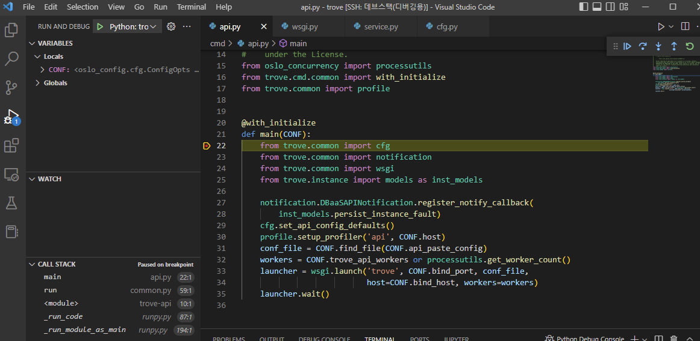
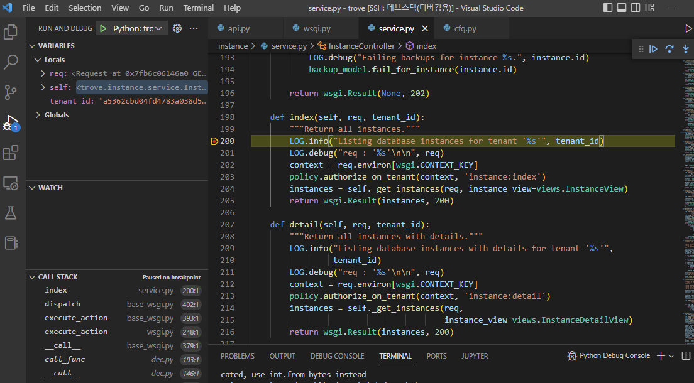

# Debugging trove-api

이 문서는 `trove-api`를 `visual studio code`에서 원격으로 디버깅 하기 위한 환경 설정을 구성한다.

!!! note "Requirements"
    * Ubuntu-20.04 LTS
    * 4 Core, 16 GB RAM 이상 ( for trove )
    * DevStack ZED version with trove, swift installed
    * Visual Studio Code

!!! note
    devstack이 설치된 remote host에 대한 `vscode`의 원격 설정 구성은 [Debugging python-openstackclient](./python-openstackclient.md)와 동일하다. 실행 계정은 `root`, remote path 는 `/opt/stack/trove/trove`

## Stop trove-api service

``` bash title="stop trove-api"
# rm -rf /etc/apache2/sites-enabled/trove-api.conf
# service apache2 restart
```

``` bash title="start trove-api"
# ln -s /etc/apache2/sites-available/trove-api.conf /etc/apache2/sites-enabled/trove-api.conf
# service apache2 restart
```


## /etc/trove/trove.conf
``` ini title="/etc/trove/trove.conf"
[DEFAULT]
...
trove_api_workers = 1
```

## launch.json 구성
``` json title=".vscode/launch.json"
{
    // Use IntelliSense to learn about possible attributes.
    // Hover to view descriptions of existing attributes.
    // For more information, visit: https://go.microsoft.com/fwlink/?linkid=830387
    "version": "0.2.0",
    "configurations": [
        {
            "name": "Python: trove-api",
            "type": "python",
            "request": "launch",
            "program": "/usr/local/bin/trove-api",
            "args": ["--config-file=/etc/trove/trove.conf", "--log-file=/var/log/trove-api.log"],
            "env": {
                "GEVENT_SUPPORT": "True",
            },
            "console": "integratedTerminal",
            "gevent": true,
            "justMyCode": false,
            "redirectOutput": true,
        }
    ]
}
```

## trove-api entry point

`/usr/local/bin/trove-api`가 실행되면 `/opt/stack/trove/trove/cmd/api.py`의 `main()`함수로 진입한다.



`main()`에서 break point 걸리는지 확인한다.

### DB 인스턴스 조회 break point
`/opt/stack/trove/trove/instance/service.py` 의 `InstanceController.index()`에 break point를 설정하고, 
DB 인스턴스 목록을 조회(`horizon`, `python-openstackclient`)하여 break point 확인한다.


