# 오픈스택 입문
---

이 문서는 오픈스택을 처음 접하는 분들이 클라우드 서비스에서 오픈스택이 어떤 역할을 하는 지에 대한 이해를 돕기 위한 목적으로 작성되었습니다. 오픈스택을 구성하는 코어 서비스의 개념적인 역할을 중심으로 기술하기 때문에 정확한 내부 구조나 동작 방식은 실제와 다를 수 있고, 오픈스택의 상세 문서를 접하기 전에 미리 이해하면 좋을 것 같은 내용을 간략한 개요와 함께 기술합니다.
2022년 10월 31일 기준 IXCloud에서 사용 중인 오픈스택 Rocky 버전을 기준으로 작성되었습니다.

## 오픈스택 이란?

오픈스택은 컴퓨팅/네트워킹/스토리지 등의 자원을 가상화하여, 이를 API를 통해 End-User에게 On-Demand로 제공하는 오픈 소스 클라우드 운영체제입니다. 

<figure markdown>
  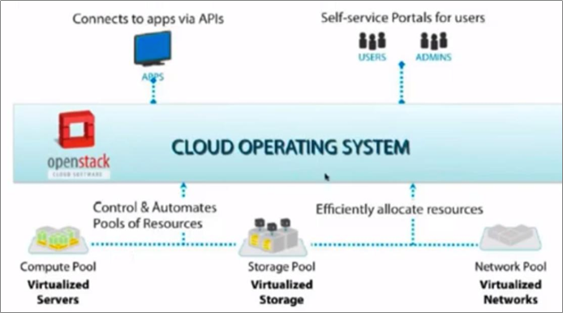
  <figcaption>오픈스택 = 클라우드 운영체제</figcaption>
</figure>

오픈스택은 CPU, RAM 등의 컴퓨팅 자원과, HDD, SSD 등의 스토리지 자원 및 L2 스위치, L3 라우터, IP 주소 등의 네트워크 자원 등을 가상화하여 관리하고, 이 자원들을 연결하여 최종 사용자에게 가상 머신을 제공하는 등의 클라우드 서비스를 제공하는 것을 목적으로 하는 플랫폼입니다.
    

<figure markdown>
  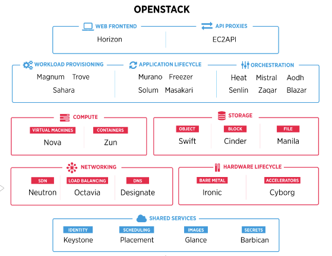
  <figcaption>오픈스택 프로젝트들</figcaption>
</figure>

오픈스택은 서비스 또는 컴포넌트라고 불리는 여러 프로젝트들의 집합입니다. 각각의 프로젝트는 클라우드 서비스를 위한 특화된 기능을 제공합니다. 

가령, 웹을 통해 대시 보드 서비스를 제공하고 싶다면 Horizon 프로젝트를 이용하고, 오브젝트 스토리지 기능을 제공하고 싶다면 Swift 프로젝트를 이용하여 서비스를 구성하면 됩니다. 또, 데이터베이스 서비스를 제공하고 싶다면 Trove 프로젝트를 추가해서 구성할 수 있습니다. 즉, 필요한 서비스들을 선택하여 자신만의 클라우드 서비스를 구성할 수 있다는 뜻입니다. 

각각의 프로젝트는 완전히 독립적으로 동작하지만, Identity 서비스(Keystone)을 통해 하나의 플랫폼으로 동작할 수 있습니다.
    

<figure markdown>
  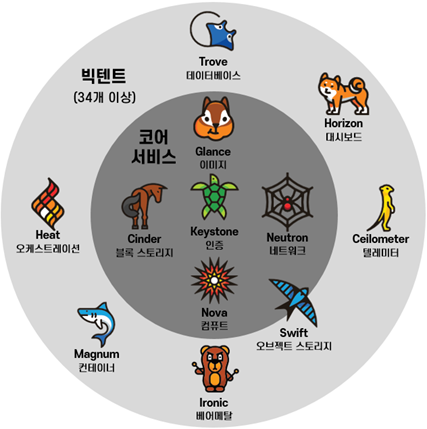
  <figcaption>코어 서비스와 빅텐트</figcaption>
</figure>

오픈스택의 프로젝트는 최소한의 클라우드 서비스를 가능하게 하는 코어 서비스와, 클라우드 서비스 확장을 위한 빅텐트 서비스로 구분할 수 있습니다. 코어 서비스는 Keystone, Glance, Cinder, Neutron, Nova 의 5개 서비스로 구성됩니다. (오브젝트 스토리지도 코어 서비스에 포함하는 경우가 있지만, IXCloud에서 사용하지 않고 있기 때문에 경계선에…)    
    
### 코어 서비스    

| 서비스 | AWS Pair | 주요 기능 |
| --- | --- | --- |
| Keystone | IAM | 각 서비스의 API 요청에 대한 인증 기능을 제공하여, 적절한 권한으로 서비스들이 동작할 수 있는 통합 환경 제공 |
| Glance | AMI | VM 인스턴스에서 사용할 OS 이미지를 제공하고 관리하는 기능을 담당 |
| Cinder | EBS | VM 인스턴스에서 사용할 볼륨 스토리지를 제공하고 관리하는 기능을 담당 |
| Neutron | VPC | VM 인스턴스가 사용할 가상의 네트워크 환경을 제공하고 관리하는 기능을 담당 |
| Nova | EC2 | CPU, RAM, NIC 등의 컴퓨팅 자원과, OS 이미지, 볼륨, 네트워크 등의 자원을 종합하여 사용자에게 가상 머신을 제공하고 관리하는 기능을 담당 |

이 문서에서는 코어 서비스에 대해 간략한 개요를 소개합니다.

## KEYSTONE - Identity Service
Keystone은 사용자 및 오픈스택 서비스 접근에 대한 인증 관련 서비스를 제공하는 서비스 컴포넌트입니다.

<figure markdown>
  ![[인증 기능 제공을 통해 서비스 통합]](../assets/img/keystone-provides-auth.png)
  <figcaption>인증 기능 제공을 통한 서비스 통합</figcaption>
</figure>

오픈스택은 분산환경에서 동작하는 여러 서비스 컴포넌트들로 운영되는 플랫폼이기 때문에, 각 서비스 컴포넌트로 오는 API 요청에 대해 인증 방법을 제공할 수 있는 중앙 집중형의 인증 서비스가 필요하게 됩니다. 이러한 요구에 맞춰 오픈스택의 서비스들의 중심에서 모든 API 요청에 인증 및 권한에 대한 서비스를 제공하는 것이 Keystone의 핵심 역할입니다. 

### Keystone 주요 기능

Keystone이 제공하는 주요 기능은 대략 다음과 같이 정리할 수 있습니다.

- 사용자, 그룹 관리
- 프로젝트, 도메인, 역할(Role) 관리
- 정책(Policy) 관리
- 서비스 목록(Catalog) 관리
- API 요청에 대한 인증/검증 제공

<figure markdown>
  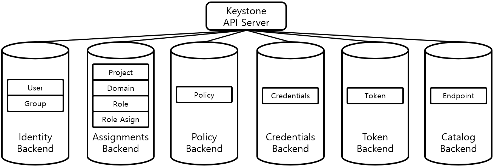
  <figcaption>Keystone 구성</figcaption>
</figure>

#### 사용자/그룹 관리

Keystone은 Identity Backend를 통해 사용자 및 그룹에 대한 정보를 관리하고 서비스를 제공합니다. 일반적으로 SQLDB를 통해 구성되며, LDAP을 이용하여 구성할 수도 있습니다. 

!!! abstract "사용자"
    사용자는 오픈스택 API 요청을 수행하는 주체를 대표하는 개념입니다. 일반적으로 우리가 사용하는 사용자 계정이라고 불리는 최종 사용자 개념을 포함해서 Nova, Neutron 등과 같은 오픈 스택 서비스도 API 요청을 수행하는 주체이기 때문에 사용자에 포함됩니다. 

!!! abstract "그룹"
    그룹은 사용자들의 집합을 의미하며, 관리자는 그룹 단위로 특정 역할을 부여하거나 프로젝트에 참여시킬 수 있습니다. 그룹은 사용자를 소유하는 관계가 아니고, 사용자는 여러 그룹에 포함될 수 있습니다.       

사용자의 자격 증명 정보(id, password, api-key 등)는 Credentials Backend에 보관되며, 인증 서비스는 보관된 자격 증명 정보를 통해 사용자의 인증을 처리합니다. 

#### 프로젝트, 도메인, 역할(Role) 관리

Keystone은 SQLDB를 이용하여 구성되는 Assignments Backend를 통해 프로젝트, 도메인, 역할 및 역할 부여(Role Assignments)에 대한 정보를 관리하고 서비스를 제공합니다.

!!! abstract "프로젝트"
    프로젝트는 클라우드 자원이 할당되어 있는 작업 공간 영역입니다. 사용자는 관리자로부터 프로젝트에 대해 권한을 부여 받아 프로젝트에 참여하고, 프로젝트에 할당된 클라우드 자원을 이용할 수 있습니다. 프로젝트는 다른 프로젝트와 자원을 공유할 수 없도록 격리되어 있습니다. 프로젝트는 사용자를 소유하는 관계가 아니기 때문에, 사용자는 여러 프로젝트에 권한을 부여 받아 참여 할 수 있습니다. 

!!! abstract "도메인"
    도메인은 사용자, 프로젝트 등을 격리하여 사용자 조직을 구분하기 위한 최상위 개념입니다. 도메인은 사용자, 프로젝트, 클라우드 자원 등을 모두 소유하고 있으며, 다른 도메인과 완전히 격리됩니다. 가령, 사용자 ID는 도메인내에서 고유해야 하지만, 도메인 간에는 중복될 수 있습니다(동명이인).

!!! abstract "역할"
    역할은 오픈스택 서비스의 동작들(set of operations)을 수행할 수 있는 권한들의 집합이며, 사용자/그룹에게 프로젝트/도메인에 대해 역할을 부여할 수 있습니다. 오픈스택 Rocky버전에서는 주어진 범위(scope: project, domain, system)에서 모든 권한을 가지는 관리자(admin) 역할과, 서비스 이용을 위한 이용자(member) 역할, read-only 권한만 가지는 reader 역할이 기본적으로 제공됩니다. 필요에 따라 특정 사용자 집단 또는 서비스에 대해 특정 권한을 행사할 수 있는 중간관리자(manager) 역할을 추가할 수도 있습니다. 역할에 따라 접근 권한을 제어하는 것을 RBAC(Role Based Access Control)이라고 하며, 역할에 부여된 권한은 각 서비스별 정책(Policy)에 의해 정의되고 제어됩니다.

Keystone은 프로젝트/도메인/역할 등에 대해 생성/목록/변경/삭제 등의 관리 기능과, 사용자/그룹에게 역할을 부여하는 기능 등을 API 를 통해 제공합니다.  

#### 정책(Policy) 관리

각각의 오픈스택 서비스는 서비스 내 자원의 접근 권한에 대한 정책을 /etc/{service}/policy.json 파일을 통해 정의하고 있습니다. 


=== "디폴트"

    ``` json title="/etc/glance/policy.json"
    {
        "context_is_admin":  "role:admin",
        "default": "role:admin",

        "add_image": "",
        "delete_image": "",
        "publicize_image": "role:admin",

      # ...
    }
    ```

=== "역할 추가"

    ``` json title="/etc/glance/policy.json" hl_lines="4 8"
    {
        "context_is_admin":  "role:admin",
        "default": "role:admin",
        "manager_required": "role:manager",

        "add_image": "",
        "delete_image": "",
        "publicize_image": "role:admin or manager_required",

      # ...
    }
    ```

위의 policy.json 은 Glance 서비스의 디폴트 정책 파일의 일부입니다.

`<target>: <rule>` 의 형식으로 되어 있으며, `target` 항목은 서비스에서 제공하는 API와 매핑되어 있습니다. 가령, `publicize_image`는 공용 이미지를 생성하거나 갱신할 수 있는 API와 매핑되어 있습니다 . 만약, 중간 관리자인 `manager` 라는 역할을 추가하고, `manager` 역할의 사용자에게 `publicize_image` API 권한을 주고 싶은 경우 `역할 추가` 부분과 같이 정책을 변경할 수 있습니다.

Keystone은 개별 서비스들의 정책 정보를 수집하여 Policy Backend 에 저장/관리하고, 각 API 요청이 있을 때 권한을 확인해 주는 기능을 제공합니다. policy.json 파일은 수정 즉시 서비스 재시작 없이도 정책에 반영되기 때문에 주의 깊게 다루어야 합니다.

<figure markdown>
  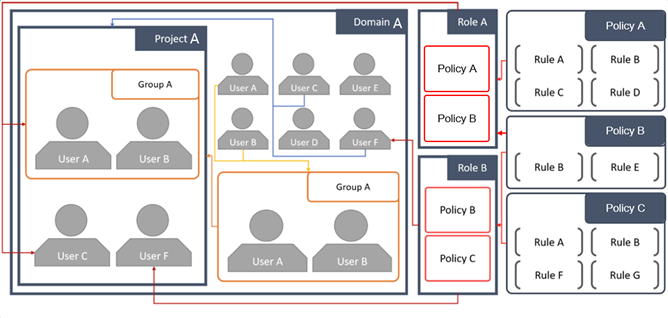
  <figcaption>사용자, 그룹, 프로젝트, 도메인, 역할, 정책 구조</figcaption>
</figure>

앞에서 살펴본 사용자, 그룹, 프로젝트, 도메인, 역할과 정책에 대한 관계는 위 그림과 같이 표현할 수 있습니다. 시스템에는 도메인 A가 존재하고, 도메인 A에는 User A 부터 User F까지 6명의 사용자와 프로젝트 A가 속해 있습니다. 프로젝트 A에는 User A와 User B가 Group A로서 Role A 역할을 부여 받아 참여하고 있고, User C도 Role A 역할을 부여 받아 참여하고 있습니다. User F는 Role B의 역할을 부여 받아 참여 하고 있습니다. Role A는 Policy A와 Policy B로 구성되어 있고, Role B는 Policy B와 Policy C로 구성되어 있습니다. 각각의 Policy는 Rule의 집합으로 정의됩니다.

#### 서비스 목록(Catalog) 관리

Keystone은 오픈스택에 등록된 서비스 목록을 관리하고, 각 서비스의 EndPoint 목록을 제공하는 기능을 수행합니다. 오픈스택은 분산된 환경에서 서비스가 동작하기 때문에, 어떤 서비스가 등록되어 있으며, API EndPoint가 어디에 있는지 중앙 집중형으로 관리할 필요가 있습니다. 

사용자는 여러 곳에 분산되어 있는 개별 서비스의 API EndPoint 위치를 알 수 없기 때문에, Keystone이 API EndPoint 목록을 사용자 권한에 맞게 정리해서 전달하여 사용자가 필요한 API EndPoint 에 요청을 보낼 수 있도록 해야합니다. 이러한 API EndPoint 목록은 인증 토큰 생성 또는 검증 요청에 대한 응답에 포함되어 전송되거나, 사용자가 `GET /v3/auth/catalog` API로 직접 요청할 수도 있습니다.

???- example "Response Example"

    ```json title="GET /v3/auth/catalog"
    {
        "catalog": [
            {
                "endpoints": [
                    {
                        "id": "39dc322ce86c4111b4f06c2eeae0841b",
                        "interface": "public",
                        "region": "RegionOne",
                        "url": "http://localhost:5000"
                    },
                    {
                        "id": "ec642f27474842e78bf059f6c48f4e99",
                        "interface": "internal",
                        "region": "RegionOne",
                        "url": "http://localhost:5000"
                    },
                    {
                        "id": "c609fc430175452290b62a4242e8a7e8",
                        "interface": "admin",
                        "region": "RegionOne",
                        "url": "http://localhost:5000"
                    }
                ],
                "id": "4363ae44bdf34a3981fde3b823cb9aa2",
                "type": "identity",
                "name": "keystone"
            }
        ],
        "links": {
            "self": "https://example.com/identity/v3/catalog",
            "previous": null,
            "next": null
        }
    }
    ```

추가적으로, 유일하게 등록된 모든 서비스의 API 목록을 가지고 있으므로, 각 API EndPoint에 대해 응답 여부를 확인하는 Health Check 기능을 수행하기도 합니다. 

#### API 요청에 대한 인증/검증 제공

API 요청에 대한 인증은 사용자가 서비스로 보낸 인증 토큰을 서비스가 Keystone에 보내 검증하는 방식으로 진행됩니다. 아래는 API 요청에 대한 인증 과정을 개념적으로 단순화 하여 보여주는 그림입니다.

<figure markdown>
  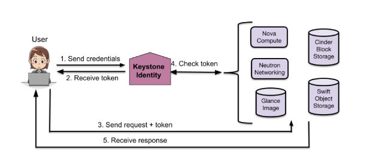
  <figcaption>기본적인 API 인증/검증 과정</figcaption>
</figure>

1. 사용자가 Keystone으로 자격 증명(id, passwd)과 함께 인증 토큰 생성 요청을 보내면 Keystone이 Credentials Backend 에 저장된 자격 증명과 비교하여 확인합니다.
2. 자격 증명 확인이 성공적으로 수행된 경우, 인증 토큰을 생성하여 Token Backend에 저장하고, 사용자에게 인증 토큰을 전송합니다.
3. 사용자는 원하는 서비스의 API EndPoint에 인증 토큰과 함께 원하는 요청을 전달합니다.
4. 
    1. API 요청을 받은 서비스는 사용자로부터 받은 인증 토큰을 Keystone으로 보내 검증을 요청합니다.
    2. Keystone은 서비스로 부터 받은 인증 토큰을 Token Backend에 저장된 인증 토큰과 비교/검증 후에 성공 여부를 응답합니다.
5. Keystone으로 부터 성공 응답을 받은 서비스는 해당 요청을 수행하고, 결과를 사용자에게 전송합니다.

오픈스택의 각 서비스는 독립적이지만, 서비스간 유기적으로 동작해야 하는 부분들이 있습니다. 가령, 사용자가 Compute 서비스에 VM 생성을 요청하게 되면, VM 생성을 위해 Image Service로 부터 OS 이미지를 제공받아야 하고, Storage 서비스로부터 볼륨, Network 서비스로부터 IP 주소 및 네트워크 정보 등을 제공 받아야 합니다. 이때, Compute 서비스가 Image, Storage, Network 서비스로 직접 API 요청을 하게 되는데, 이 요청에서는  Compute 서비스가 사용자 역할이 되어 위의 (1)-(5)의 과정을 비슷하게 거친다고 할 수 있습니다. 서비스도 사용자로 등록되어야 하는 이유라고 할 수 있습니다.

### 참고 자료
Keystone(Rocky) documents - [https://docs.openstack.org/keystone/rocky/index.html](https://docs.openstack.org/keystone/rocky/index.html)  
Keystone API - [https://docs.openstack.org/api-ref/identity/](https://docs.openstack.org/api-ref/identity/)  
Mapping of policy target to API - [https://docs.openstack.org/keystone/rocky/getting-started/policy_mapping.html](https://docs.openstack.org/keystone/rocky/getting-started/policy_mapping.html)


## GLANCE - Image Service

Glance는 오픈스택의 다른 서비스(주로 가상 머신)에서 사용할 VM 이미지를 관리하고 제공하는 서비스 컴포넌트입니다. 이미지는 우리가 흔히 VirtualBox나 VMWare 등을 통해 OS를 설치할 때 사용하는 설치 이미지라기보다는 가상 머신에 탑재되어 부팅과 함께 바로 작동 가능한 OS가 이미 설치되어 있는 디스크 이미지를 의미합니다. 

### Glance 서비스 구성

Glance 서비스는 다음과 같이 구성되어 있습니다.

<figure markdown>
  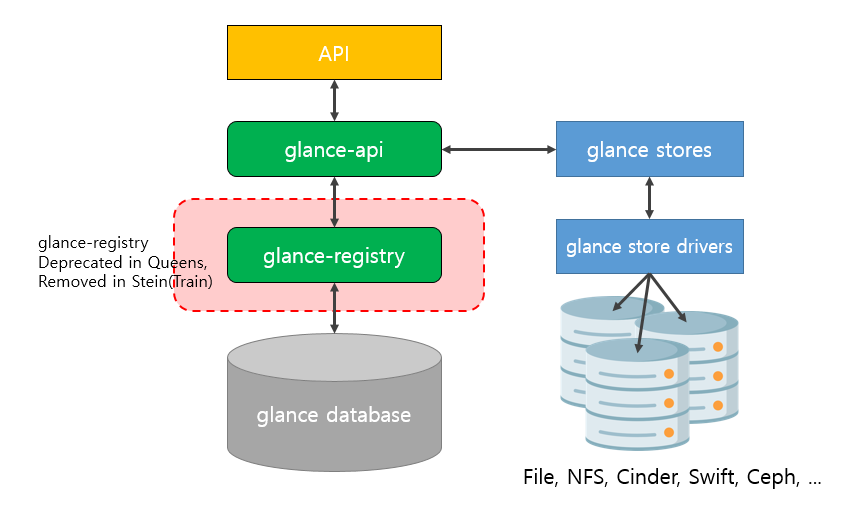
  <figcaption>Glance 구성</figcaption>
</figure>


#### glance-api
:   glance-api는 image service의 API EndPoint를 제공하며, 데이터베이스 계층을 추상화하여 접근하기 위해 glance-registry 를 이용해 데이터베이스에 접근합니다. 
    또한, 이미지 파일의 물리적 저장소로 로컬 디스크 뿐만 아니라, 네트워크 파일 시스템, 블록 스토리지, 오브젝트 스토리지 등 glance store driver가 지원하는 여러 형태의 storage backend를 사용할 수 있습니다.

#### glance-registry
:   glance-registry는 데이터베이스에 대해 추상화된 접근 기능을 제공합니다. 
    그러나, use case 가 떨어지고, 버전의 유지 보수가 어려운 문제 때문에 openstack queens 버전부터 deprecated 되었고, stein 버전 부터 제거되어 glance-api 에서 직접 데이터베이스로 접근하도록 변경되었습니다.

#### glance database
:   이미지와 메타데이터 정의에 대한 정보 등을 저장하는 SQLDB 입니다. 

<figure markdown>
  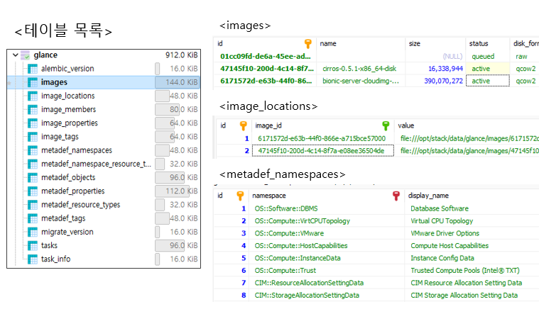
  <figcaption>DATABASE SCHEMA</figcaption>
</figure>


주로 이미지와 관련된 테이블(images, image_*)과 메타데이터 정의 관련 테이블(metadef_*)로 구성되어 있음을 알 수 있습니다.

### Glance 주요 기능

Glance 서비스가 제공하는 주요 기능은 다음과 같이 정리할 수 있습니다.

- 이미지 관리 기능
- 이미지 파일 전송 기능
- 메타데이터 정의 서비스

#### 이미지 관리 기능

Glance 서비스는 아래의 API를 통해 이미지의 등록, 조회, 수정, 삭제 기능 등을 제공합니다.

| API-NAME | METHOD | URL | DESCRIPTION |
| --- | --- | --- | --- |
| create-image | POST | /v2/images | Create image |
| show-image | GET | /v2/images/{image_id} | Show image |
| list-images | GET | /v2/images | List images |
| update-image | PATCH | /v2/images/{image_id} | Update image |
| delete-image | DELETE | /v2/images/{image_id} | Delete image |

`create-image` API를 통해 이미지 정보를 데이터베이스에 등록할 수 있습니다. 이 단계에서는 데이터베이스에 이미지 정보 레코드만 생성 되며, 이후 이미지 파일 전송 기능의 `upload-image` API 호출을 통해 이미지 파일을 업로드 해야 합니다.

`list-images` API는 이미지를 검색하는 기능을 제공하고, `show-image`는 이미지 정보를 조회할 수 있는 기능을 제공합니다.

`update-image` API를 통해 이미지 정보(속성, 태그 등)의 수정이 가능합니다.

`delete-image` API를 통해 이미지 정보와 이미지 파일을 삭제할 수 있습니다. 

`download-image` API를 통해 이미지 파일을 다운로드 할 수 있습니다. Nova 서비스와 같은 다른 서비스들은 일반적으로 이 API를 통해 이미지 파일을 다운로드 받습니다.

#### 이미지 파일 전송 기능

Glance 서비스는 아래의 API를 통해 이미지의 업로드와 다운로드 기능을 제공합니다.

| API-NAME | METHOD | URL | DESCRIPTION |
| --- | --- | --- | --- |
| upload-image | PUT | /v2/images/{image_id}/file | Upload binary image data |
| download-image | GET | /v2/images{image_id}/file | Download binary image data |

`create-image` API 호출을 통해 이미지 정보를 등록하고 나면(status=queued), `upload-image` API 호출을 통해 이미지 파일을 업로드 해야 합니다. 이미지 파일 업로드가 성공하면, status가 active가 되어, 이미지의 사용이 가능해 집니다. 업로드된 이미지는 storage backend 구성에 따라, 원격지의 저장소에 저장될 수도 있습니다.

`download-image` API 호출을 통해 이미지 파일을 다운로드 받을 수 있습니다. Nova 서비스는 일반적으로 이 API를 통해 인스턴스 생성을 위한 이미지 파일을 전송 받지만, storage backend 구성에 따라, 원격지 저장소의 direct_url을 통해 직접 다운로드 받을 수도 있습니다. 

#### 메타데이터 정의 서비스

Glance 서비스는 다양한 종류의 클라우드 자원에서 사용할 수 있는 메타데이터를 정의하고 관리할 수 있는 기능을 API를 통해 제공합니다.

<figure markdown>
  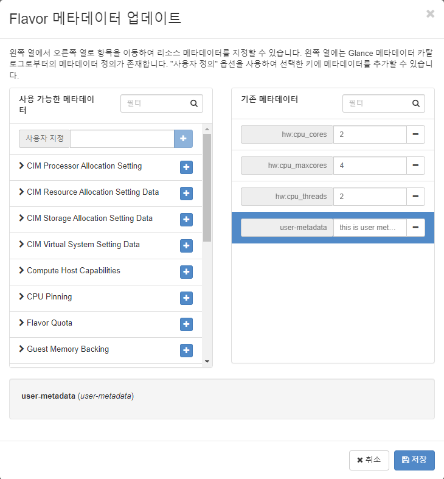
  <figcaption>Horizon Flavor Metadata Settings</figcaption>
</figure>

Glance 서비스가 기본적으로 제공하는 메타데이터 정의 외에도, 사용자나 서비스가 직접 메타데이터를 정의하고 관리할 수 있습니다.

메타데이터 정의 서비스는 메타데이터의 정의에 대한 관리를 할 뿐, 클라우드 자원 인스턴스의 실제 메타데이터 값을 관리하지는 않습니다. 클라우드 자원 인스턴스에 메타데이터 값을 설정하면, 해당 자원을 소유하고 있는 서비스에 저장됩니다. 위 그림과 같이 Flavor에 메타데이터를 설정하면 아래 그림과 같이 자원을 소유한 Nova 서비스의 데이터베이스에 저장됩니다. 

<figure markdown>
  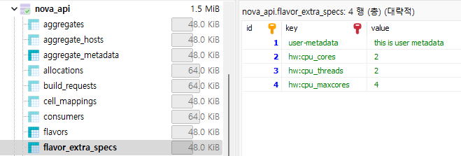
  <figcaption>metadata store for flavor</figcaption>
</figure>


### 이미지를 이용한 VM 생성

Nova 서비스는 아래 그림과 같이 Glance로 부터 이미지를 제공받아, VM 인스턴스를 생성합니다.

<figure markdown>
  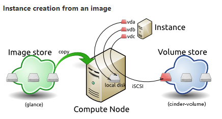
  <figcaption>Instance creation from an image</figcaption>
</figure>

glance stores 에 저장된 이미지 파일을 컴퓨트 노드로 다운로드 받아와서, 그 이미지를 VM 인스턴스의 root volume과 연결하여 인스턴스에 OS를 제공합니다.

결론적으로, Glance 서비스는 Nova 서비스에 OS 이미지를 제공하는 것이 핵심 기능이고, 그 이미지들을 관리하는 기능을 포함하고 있는 서비스 컴포넌트라고 할 수 있습니다.

### 참고 자료
Glance(Rocky) documents - [https://docs.openstack.org/glance/rocky/](https://docs.openstack.org/glance/rocky/)  
Image v2 API - [https://docs.openstack.org/api-ref/image/v2/index.html](https://docs.openstack.org/api-ref/image/v2/index.html?expanded=)  
Image Metadata v2 API - [https://docs.openstack.org/api-ref/image/v2/metadefs-index.html](https://docs.openstack.org/api-ref/image/v2/metadefs-index.html)  

## CINDER - Block Storage Service

Cinder 서비스는 VM, bare metal, container 등에 영구적인 볼륨을 제공하고, 제공된 볼륨을 효과적으로 관리하는 기능을 제공하는 서비스 컴포넌트입니다. HDD, SSD, LVM, iSCSI, NetApp, ZADARA 등의 여러 물리적 저장 장치, 컨트롤러, 벤더 사의 스토리지 장치를 추상화하여 VM에서 사용 가능한 볼륨 형태로 제공하는 것이 핵심 기능입니다.

### 스토리지 유형

!!! info "Ephemeral Storage vs Persistent Storage"
    - Ephemeral Storage는 VM 인스턴스의 수명 주기(Life-Cycle)을 따르는 휘발성 스토리지입니다. VM 인스턴스 생성과 함께 생성되었다가, VM 인스턴스의 삭제와 함께 삭제됩니다. 
    - Persistent Storage는 VM 인스턴스의 수명 주기와 무관하게 사용자 요청에 의해 생성/삭제되는 지속성 스토리지입니다. 또한, 사용자 요청에 의해 스냅샷을 생성하거나, VM 인스턴스에 장착/탈착이 가능합니다.

!!! info "Block Storage vs Object Storage"
    - 블록 스토리지는 일반적으로 우리가 하드 디스크라고 부르는 형태로, Block 단위로 저장소를 제공하는 스토리지 입니다. 
    - 오브젝트 스토리지는 고유 식별자(ID or Key), 데이터(파일), 메타데이터(권한 등) 등으로 구성된 개별 오브젝트 단위로 데이터를 관리하는 스토리지입니다. 대표적으로 AWS의 S3 서비스를 들 수 있습니다.

이러한 스토리지 유형중에서, Cinder 서비스는 Persistent Storage + Block Storage 형태로 VM에 볼륨을 제공합니다. 또한, Nova 서비스는 Ephemeral Storage + Block Storage 형태로 VM에 볼륨을 제공하고, Swift 서비스는 Persistent Storage + Object Storage 형태의 저장소를 제공합니다.

### Cinder 서비스 구성

<figure markdown>
  
  <figcaption>Cinder Service Architecture</figcaption>
</figure>

#### cinder-api
:   cinder-api 컴포넌트는 사용자에게 API EndPoint를 제공하고, API 요청을 필요한 프로세스로 전달하는 역할을 수행하는 프로세스입니다. 
    가령, 볼륨 생성 요청을 받으면, 볼륨을 생성할 적절한 제공자 노드를 선택하기 위해 cinder-schduler 프로세스로 메세지를 보내고, cinder-scheduler는 적절한 스토리지 제공자 노드를 선택하여 cinder-volume 프로세스로 메세지를 보내 실제 볼륨을 생성할 수 있도록 합니다.

#### cinder-scheduler
:   cinder-scheduler 컴포넌트는 현재 스토리지 할당 현황, 메타데이터 등을 참고하여, 볼륨을 생성할 적절한 스토리지 노드를 결정하는 기능을 수행하는 프로세스입니다. 
    nova-scheduler와 비슷하게 스토리지에 대해 provisioning 할 노드를 선택하는 기능이라고 할 수 있습니다. 

#### cinder-volume
:   cinder-volume 컴포넌트는 다양한 스토리지 드라이버를 통해 물리적인 volume backend와 직접 상호작용 하는 컴포넌트입니다. 
    cinder-scheduler가 볼륨을 생성할 스토리지 노드를 선택해 Message Broker를 통해 전달하면, cinder-volume 프로세스가 스토리지 노드에 볼륨을 생성하여 제공합니다.

#### cinder-backup
:   cinder-backup 컴포넌트는 여러 유형의 볼륨을 볼륨 백업 저장소(volume backup repository)로 백업해 주는 기능을 제공하는 프로세스입니다. 

#### Message Broker
:   Message Broker(Message Queue)는 Cinder 내부의 주요 프로세스 간 메세지를 전달하는 단일화된 창구역할을 하는 AMQP(Advanced Message Queing Protocol) 이며, 오픈스택에서는 주로 RabbitMQ 를 사용합니다. 
    가령, 사용자가 볼륨 생성 요청을 cinder-api로 보내면, cinder-api는 볼륨을 생성할 적당한 스토리지를 선택하기 위해 Message Broker를 통해 cinder-scheduler로 요청을 전달합니다. cinder-scheduler는 현재 스토리지 할당 현황을 참고하여 볼륨 생성 요청을 Message Broker를 통해 cinder-volume 프로세스로 전달하여 볼륨을 생성하도록 합니다. 
    만약, Message Broker가 존재하지 않는다면, cinder-api, cinder-scheduler, cinder-volume, cinder-backup 프로세스간 개별적으로 모두 연결해야 하기 때문에 연결 구조가 훨씬 복잡해 질 수 있지만, Message Broker를 통해 단일화 된 창구를 제공할 수 있습니다. 

### Cinder 서비스 주요 기능

- VM 인스턴스에 볼륨 제공
- 볼륨 관리 기능
- 볼륨 스냅샷 및 백업 기능

#### VM 인스턴스에 볼륨 제공

<figure markdown>
  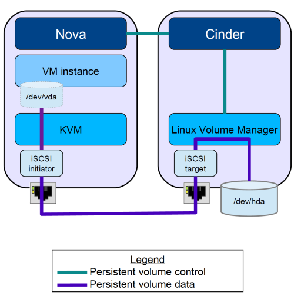
  <figcaption>VM 인스턴스에 iSCSI 프로토콜을 이용해 볼륨 제공</figcaption>
</figure>

Cinder 서비스를 통해 생성된 볼륨(/dev/hda)은 위 그림과 같이 iSCSI 프로토콜을 이용해 원격지 호스트의 VM 인스턴스와 연결되어, 볼륨에 직접 읽고 쓰기가 가능해 집니다. 일반적으로, Cinder의 기본 블록 스토리지 드라이버는 iSCSI 기반의 LVM(Logical Volume Manager) 이지만, 아래 그림과 같이 다양한 블록 스토리지 드라이버를 사용할 수 있습니다.

<figure markdown>
  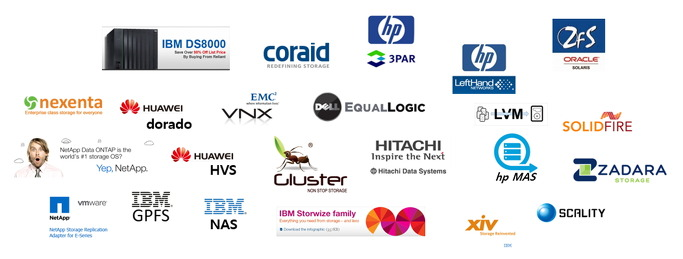
  <figcaption>블록 스토리지 드라이버 목록: https://wiki.openstack.org/wiki/CinderSupportMatrix</figcaption>
</figure>


#### 볼륨 관리 기능

cinder-api 가 제공하는 API EndPoint를 통해, 볼륨에 대해 CRUD(Create/Read/Update/Delete) 작업이 가능합니다. 또한, 동적으로 볼륨을 VM에서 분리하거나, 다른 VM에 장착할 수 있습니다. 

#### 볼륨 스냅샷 및 백업 기능

Cinder 서비스는 볼륨에 대해 사본을 생성하거나(스냅샷), Volume Backup Repository의 여러 장치로 백업할 수 있습니다. 

### 참고 자료
Cinder(Rocky) documents - [https://docs.openstack.org/cinder/rocky/](https://docs.openstack.org/cinder/rocky/)  
Cinder V3 API References - [https://docs.openstack.org/api-ref/block-storage/v3/index.html](https://docs.openstack.org/api-ref/block-storage/v3/index.html)  

## NEUTRON - Network Service

Neutron 서비스는 L2-Switch, L3-Router 등의 물리적인 네트워크 장치를, 소프트웨어로 구현한 가상화 네트워크로 추상화하여(SDN, Software Defined Network), 사용자 요구에 맞게 구성된 가상 네트워크 인프라를 제공하는 서비스 컴포넌트입니다. 

<figure markdown>
  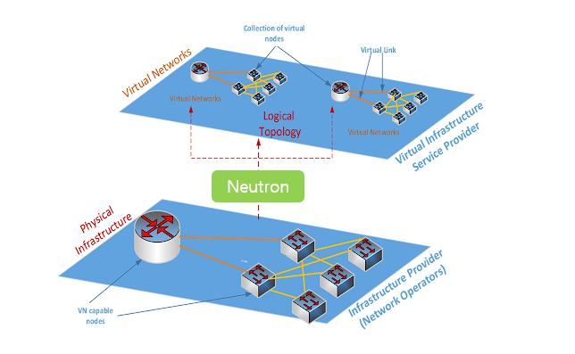
  <figcaption>Physical Infrastructure to Virtual Networks(Overlay Networks)</figcaption>
</figure>

보다 개념적으로 이해하자면, 위 그림과 같이 물리적으로 분산된 네트워크 환경에서 동작하는 VM에게 논리적으로 구성된 오버레이 네트워크 환경을 제공하는 것이 주요 기능이라고 할 수 있습니다. 

> Neutron 서비스는 원래 Nova 서비스 내부에 Nova-Network 라는 서브 컴포넌트로 존재했지만, Nova의 하부 컴포넌트로는 다양한 네트워크 환경 요구를 수용할 수 없어, Folsom 버전부터 Quantum 이라는 이름의 독립된 서비스 컴포넌트로 릴리즈 됐습니다. 
> 이후, 상표권 문제 등으로 Havana 버전부터 Neutron 으로 이름이 변경되었습니다. 
> 그래서, 데브스택의 Nova 관련 서비스들은 devstack-q\*(Quantum) 입니다.

### Neutron 서비스 구성

<figure markdown>
  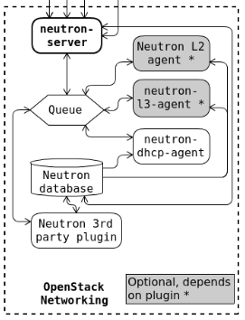
  <figcaption>Neutron Architecture</figcaption>
</figure>

#### neutron-server
:   Neutron 서비스의 API EndPoint 를 제공하고, 사용자의 API 요청을 처리하는 기능을 제공합니다. neutron-server는 message queue를 통해 L2 Agent, L3 Agent, DHCP Agent에게 필요한 자원의 할당을 요청할 수 있습니다.

#### neutron-l2-agent
:   L2-Switch(브릿지) 장치를 가상화하여 제공해 주는 Agent 입니다. ML2 플러그인을 이용하고, Linux Bridge, Open vSwitch 등의 메카니즘 드라이버를 이용하여 L2 Switch 가상화를 구현합니다. 


#### neutron-l3-agent
:   L3-Router 장치를 가상화하여 제공해 주는 Agent 입니다. 마찬가지로 Linux Bridge, Open vSwitch 등의 메카니즘 드라이버를 이용하여 L3 Router 가상화를 구현합니다.

#### neutron-dhcp-agent
:   DHCP 서버를 제공하는 Agent 입니다.

### Neutron 서비스 주요 기능

- VM에 L2 네트워크 환경 제공
- L2 네트워크에 L3 라우터 제공
- DHCP 서버 제공

Neutron 서비스는 네트워크의 생성/변경/삭제 등에 대한 API를 제공하고, 실제 네트워크 기능은 각 Network Provider를 통해  SDN 환경을 구성합니다. 가령, L2 스위치 기능은 neutron-l2-agent(ML2 플러그인)을 통해 제공되고, L3 라우터 기능은 neutron-l3-agent, DHCP 기능은 neutron-dhcp-agent를 통해 제공됩니다.

#### ML2(Modular Layer 2) plug-in

ML2 플러그인은 사용자의 가상 L2 네트워크를 구현할 수 있도록 소프트웨어 L2 스위치(브릿지) 장비를 제공해주는 플러그인이며, 아래 그림은 대표적으로 지원하는 Type Driver와 Mechanism Driver를 나타냅니다.

<figure markdown>
  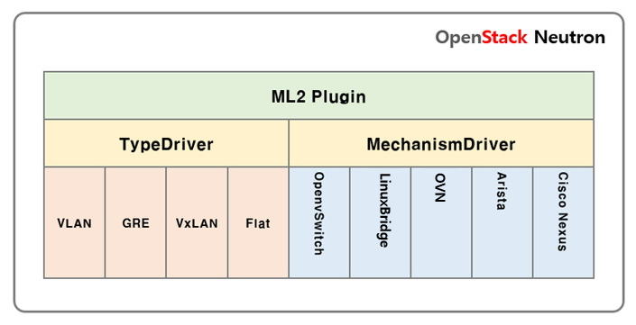
  <figcaption>ML2 Plugin Drivers</figcaption>
</figure>

Type Driver는 L2 스위치 장비가 지원할 L2 네트워크 유형을 정의하며, Mechanism Driver는 실제로 L2 스위치 장비를 가상화하여 제공할 소프트웨어 드라이버를 의미합니다. 

사용자에게 제공할 수 있는 L2 네트워크의 유형은 Mechanism Driver에 의해 결정되며, 메카니즘 드라이버에 따른 L2 네트워크 유형은 아래 표와 같습니다.

ML2 driver support matrix

| Mechanism Driver | Flat | VLAN | VXLAN | GRE | Geneve |
| --- | --- | --- | --- | --- | --- |
| Open vSwitch | yes | yes | yes | yes | yes |
| Linux Bridge | yes | yes | yes | no | no |
| OVN | yes | yes | yes | no | yes |
| SRIOV | yes | yes | no | no | no |

가령, 메카니즘 드라이버로 SRIOV를 사용하면, 사용자에게 VXLAN 유형의 L2 네트워크는 제공할 수 없다는 뜻입니다. 또한, Flat, VLAN 네트워크만 제공할 계획이라면 위 표의 어떤 메카니즘 드라이버를 선택해도 무방하다는 뜻이기도 합니다.

#### neutron-l3-agent

L3 라우터를 가상화하여 제공하는 소프트웨어 L3 Agent 이며, 사용하는 메카니즘 드라이버의 Agent(ovs-agent, linuxbridge-agent, 등)를 통해 제공됩니다. 호스트와 별도의 네트워크 네임스페이스 상에 존재하며, 가상화된 L2 네트워크의 라우팅을 위해 자체 라우팅 테이블을 가집니다.

```bash title="호스트의 라우팅 테이블과 가상 라우터의 라우팅 테이블" hl_lines="4 10 15"
root@controller:~# route -n
Kernel IP routing table
Destination     Gateway         Genmask         Flags Metric Ref    Use Iface
0.0.0.0         192.168.42.1    0.0.0.0         UG    0      0        0 ens3
169.254.169.254 192.168.42.1    255.255.255.255 UGH   0      0        0 ens3
192.168.42.0    0.0.0.0         255.255.255.0   U     0      0        0 ens3
192.168.42.128  0.0.0.0         255.255.255.128 U     0      0        0 br-ex
192.168.122.0   0.0.0.0         255.255.255.0   U     0      0        0 virbr0
root@controller:~# ip netns
qrouter-43a1b81b-93fa-4ddc-8f32-469c3dc8e7c7
qdhcp-267c5fb7-bcf4-4f42-bc70-ee89c88cb15f
root@controller:~# ip netns exec qrouter-43a1b81b-93fa-4ddc-8f32-469c3dc8e7c7 route -n
Kernel IP routing table
Destination     Gateway         Genmask         Flags Metric Ref    Use Iface
0.0.0.0         192.168.42.129  0.0.0.0         UG    0      0        0 qg-7f32c975-1f
172.16.0.0      0.0.0.0         255.255.255.192 U     0      0        0 qr-b856e3ac-ee
192.168.42.128  0.0.0.0         255.255.255.128 U     0      0        0 qg-7f32c975-1f
root@controller:~#
```

#### neutron-dhcp-agent

DHCP 서버를 가상화하여 제공하는 DHCP Agent 입니다. 사용하는 메카니즘 드라이버에 따라, Open vSwitch, Linux Bridge 등의 Agent를 통해 제공됩니다. 필요에 따라 고가용성(High Availabilty)으로 구성하거나(IXCloud의 경우 dhcp_agents_per_network = 3) 네트워크에서 DHCP Agent를 제거하고 VM 인스턴스에 static ip address 를 설정하여 사용하도록 할 수도 있습니다.

#### 결론: Neutron 서비스의 역할?

<figure markdown>
  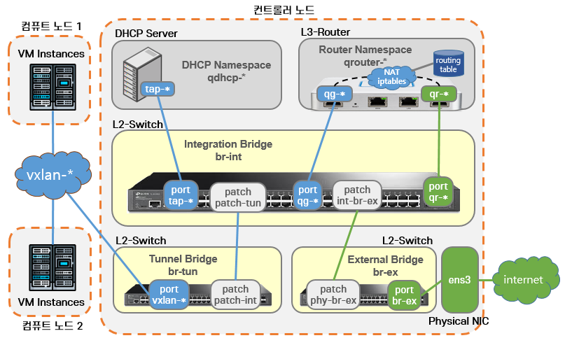
  <figcaption>컨트롤러 노드 네트워크 연결 구조 ( Open vSwitch, VxLan )</figcaption>
</figure>

Neutron 서비스를 이용한 사용자 네트워크 구성은 클라우드 서비스 프로바이더 인프라 상황과 네트워크 유형, 메카니즘 드라이버 등에 따라 대단히 다양한 방식으로 구성될 수 있습니다. 위 그림은 DevStack Rocky 버전을 멀티 노드로 설치했을 때의 모습이며, Neutron 서비스의 이해를 돕기 위한 참고 자료용입니다.

컨트롤러에는 기본적으로 호스트 네임스페이스 영역에 3개의 L2 스위치가 생성되어 있고, patch 인터페이스를 통해 br-int 를 중심으로 서로 연결이 되어 있습니다. br-int 스위치는 각 인터페이스를 통합(integration)하는 메인 스위치 역할을 하고, br-tun은 노드간 터널링을 목적으로 하는 스위치입니다. br-ex는 외부 네트워크(인터넷) 연결을 목적으로 하며, 인터넷에 연결된 물리 네트워크 인터페이스와 연결되어 있습니다.

사용자가 대시 보드를 통해 인터넷에 연결된 네트워크와 함께 VM 인스턴스를 생성하면 Neutron 서비스는 다음과 같은 과정을 통해 VM 인스턴스에 사용자 네트워크를 제공합니다.

- 컨트롤러 노드와 컴퓨트 노드의 br-tun 스위치에 vxlan-* 포트를 생성하고 서로 연결합니다.
- VM 인스턴스의 NIC와 연결된 tap-* 인터페이스를 생성하여 컴퓨트 노드의 br-int 스위치에 연결합니다.
- vxlan-* 네트워크의 통신을 위한 qrouter-* 라우터를 라우팅 테이블을 적용해 생성하고, 게이트웨이용 qg-* 포트와 외부용 qr-* 포트를 생성하여 br-int 에 연결합니다.
- 네트워크에 DHCP 기능을 제공하기 위해 DHCP 서버를 생성합니다.

이 과정을 통해 VM은 사용자 네트워크를 통해 다른 VM과 통신할 수 있고, 외부 네트워크(인터넷)에도 접속할 수 있습니다.

결론적으로, Neutron 서비스는 가상의 네트워크 장비를 통해, 분산 환경에서 사용자 네트워크 환경을 VM에게 제공하는 역할을 한다고 할 수 있습니다.

### 참고 자료
Neutron(Rocky) documents - [https://docs.openstack.org/neutron/rocky/](https://docs.openstack.org/neutron/rocky/)  

## NOVA - Compute Service

Nova 서비스는 하이퍼바이저를 통해 CPU, RAM 등의 컴퓨팅 자원을 할당하여 VM 인스턴스를 제공하고, VM을 관리할 수 있는 기능을 제공하는 서비스 컴포넌트입니다. Nova 서비스는 Glance 서비스로부터 OS 이미지, Cinder 서비스로 부터 볼륨, Neutron 서비스로 부터 네트워크를 제공 받아 최종적으로 사용자가 사용할 수 있는 VM 인스턴스를 생성하여 제공합니다. 클라우드 서비스를 위한 최소한의 필요 기능이며, 나머지 코어 서비스는 Nova 서비스를 위한 리소스 제공 서비스라고 할 수 있습니다.

### Nova 서비스 구성

<figure markdown>
  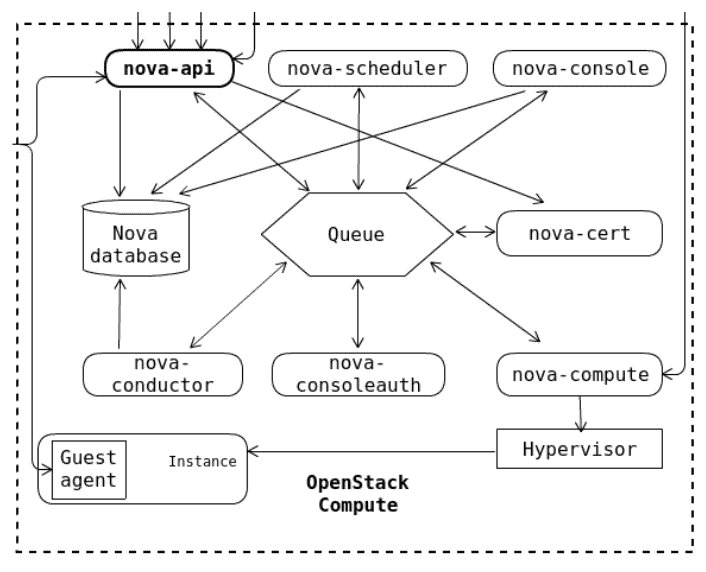
  <figcaption>Nova Service Architecture</figcaption>
</figure>

Nova 서비스는 그림과 같이 nova-api, nova-scheduler, nova-conductor, nova-compute 를 주요 구성 요소로 동작하며, 대개 컨트롤러 노드와 다수의 컴퓨트 노드로 구성됩니다. 각 구성 요소의 주요 기능은 아래와 같습니다. 

#### nova-api
:   nova-api 모듈은 사용자에게 API EndPoint를 제공하며, API 요청에 대해 적절한 프로세스로 요청을 전달하는 등 API 요청에 대한 처리를 관장(Orchestration)합니다. 가령, 사용자가 VM 생성 요청을 보내면, nova-api가 이 요청을 수신하여 VM을 생성할 적절한 컴퓨트 노드를 결정하기 위해 nova-scheduler로 요청을 전달하고, 최종적으로 nova-compute로 요청이 전달되어 해당 컴퓨트 노드에 VM이 생성됩니다. nova-api 모듈은 컨트롤러 노드에 존재합니다.

#### nova-compute
:   nova-compute 모듈은 각 컴퓨트 노드 상에 존재하며, 하이퍼바이저와 직접 상호작용하며 VM의 수명 주기 등을 관리하는 기능을 제공합니다. 가령, 하이퍼바이저로 KVM을 사용하는 컴퓨트 노드의 nova-compute 모듈이 VM 생성 요청을 수신하면 KVM API인 libvirt-api 를 호출하여 VM을 생성합니다. 마찬가지로, VM의 삭제, 재부팅, 일시정지, 크기(Flavor) 변경 등의 작업도 하이퍼바이저 API 호출을 통해 관리할 수 있습니다. 

#### nova-scheduler
:   nova-scheduler 모듈은 2대 이상의 컴퓨트 노드가 존재할 때, CPU/RAM/Disk/메타데이터 등의 리소스 필터를 참고하여 VM을 생성할 적절한 컴퓨트 노드를 결정하는 기능을 제공합니다. nova-api 로부터 VM 생성 요청을 수신하면, 자원 할당 현황, 가용존, 메타데이터 정보를 참고하여 VM을 할당할 가장 적당한 컴퓨트 노드를 결정하고, 메세지 큐를 통해 해당 컴퓨트 노드의 nova-compute 모듈로 VM 생성 요청을 보내 VM을 생성하도록 합니다. nova-scheduler 모듈은 컨트롤러 노드에 존재합니다.

#### nova-conductor
:   nova-conductor 모듈은 nova-compute 모듈이 데이터베이스에 접근할 수 있도록 proxy 기능을 제공합니다. 컴퓨트 노드가 외부 공격에 의해 해킹되더라도 전체 데이터베이스를 보호할 수 있도록 nova-compute 모듈은 데이터베이스에 직접 접근할 수 없도록 설계되었습니다. nova-compute는 nova-conductor가 제공하는 API를 통해서만 데이터베이스에 접근할 수 있으며, 같은 이유로 nova-conductor 모듈은 컴퓨트 노드에 설치되어서는 안되고, 컨트롤러 노드에 존재해야 합니다.

### Nova 서비스 주요 기능

- 하이퍼바이저를 통한 VM 인스턴스 제공
- 컴퓨트 서비스 API EndPoint 제공

#### 하이퍼바이저를 통한 VM 인스턴스 제공

하이퍼바이저는 CPU, RAM, DISK, NIC 등의 물리 서버의 자원을 추상화하고, 논리적으로 공간을 분할하여 독립적인 가상 환경의 서버(VM)를 제공하는 소프트웨어입니다. 

<figure markdown>
  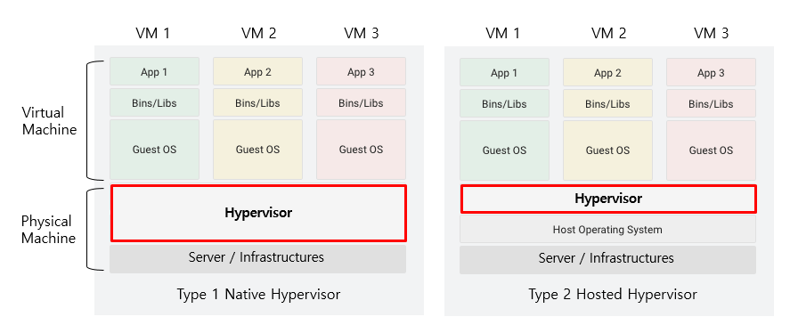
  <figcaption>Native Hypervisor  & Hosted Hypervisor</figcaption>
</figure>

하이퍼바이저는 물리적 하드웨어 위에서 직접 실행되는 Type 1 Native (전가상화) 방식과, 호스트의 OS 위에서 에뮬레이터 형태로 실행되는 Type 2 Hosted (반가상화) 방식으로 구분할 수 있습니다.

Type 2 하이퍼바이저로는 우리가 흔히 접할 수 있는 VirtualBox, VMWare와 QEMU 등이 있습니다.

Type 1 하이퍼바이저는 물리적 하드웨어를 직접 제어하기 때문에 자원을 효율적으로 사용할 수 있어 클라우드 서비스에 적합한 방식이며, Xen, VMWare vSphere, Hyper-V 등이 이에 해당합니다. KVM(Kernel-based Virtual Machine)은 리눅스라는 호스트 OS에서 동작하지만 커널 수준에서 동작하기 때문에 Type 1 하이퍼바이저라고 할 수 있습니다. 또한, KVM과 QEMU는 상호보완적인 기능을 하기 때문에, KVM-QEMU를 함께 사용합니다.

오픈스택 Rocky 버전 기준으로 지원하는 하이퍼바이저 목록은 다음과 같습니다.
[https://docs.openstack.org/nova/rocky/admin/configuration/hypervisors.html](https://docs.openstack.org/nova/rocky/admin/configuration/hypervisors.html)

| 하이퍼바이저 | 설명 |
| --- | --- |
| KVM | Kernel-based Virtual Machine. The virtual disk formats that it supports is inherited from QEMU since it uses a modified QEMU program to launch the virtual machine. The supported formats include raw images, the qcow2, and VMware formats. |
| LXC | Linux Containers (through libvirt), used to run Linux-based virtual machines. |
| QEMU | Quick EMUlator, generally only used for development purposes. |
| VMWare vSphere 5.1.0 and newer | Runs VMware-based Linux and Windows images through a connection with a vCenter server. |
| Xen( Libvirt ) | Xen Project Hypervisor using libvirt as management interface into  nova-compute to run Linux, Windows, FreeBSD and NetBSD virtual machines. |
| XenServer | XenServer, Xen Cloud Platform (XCP) and other XAPI based Xen variants runs Linux or Windows virtual machines. You must install the nova-compute service in a para-virtualized VM. |
| Hyper-V | Server virtualization with Microsoft Hyper-V, use to run Windows, Linux, and FreeBSD virtual machines. Runs nova-compute natively on the Windows virtualization platform. |
| Virtuozzo 7.0.0 ↑ | OS Containers and Kernel-based Virtual Machines supported via libvirt virt_type=parallels. The supported formats include ploop and qcow2 images. |
| PowerVM | Server virtualization with IBM PowerVM for AIX, IBM i, and Linux workloads on the Power Systems platform. |
| zVM | Server virtualization on z Systems and IBM LinuxONE, it can run Linux, z/OS and more. |


Nova 서비스는 하이퍼바이저를 통해 생성한 VM과 Cinder, Neutron, Glance 서비스 등에서 할당받은 자원을 연결하여 최종 사용자에게 사용 가능한 상태의 VM을 제공합니다.

#### 컴퓨트 서비스 API EndPoint 제공

Nova 서비스는 컴퓨트 서비스의 주요 항목과 관련된 대단히 많은 API를 제공합니다. 주요 항목은 다음과 같습니다.

#### Servers

VM 인스턴스와 관련된 모든 API를 제공합니다. VM의 생성, 삭제, 재부팅 등과 같이 수명주기와 관련된 API 부터 RDP, Serial, VNC console 등과 같이 서버 접근 관련 API도 제공합니다.

#### Flavors

Flavor는 vCPU의 갯수, vRAM의 크기, root volume 크기 등 VM의 하드웨어 설정을 의미하며, 컴퓨트 서비스는 Flavor로 정의된 설정으로만 VM을 생성할 수 있습니다. nova-scheduler는 Flavor 정보에 포함된 Extra Spec, Metadata 등의 정보를 참고하여 컴퓨트 노드를 결정합니다.

#### Keypairs

생성된 VM에 사용자가 SSH로 접근하기 위해 사용할 SSH Keypair를 관리할 수 있는 API를 제공합니다. 키를 생성하거나, 가져오기, 삭제하기 등의 API를 제공합니다.

#### Quota

Quota는 프로젝트에 할당된 자원의 제한을 의미하며, Quota와 관련된 API를 제공합니다.

#### 기타

이 외에도 Nova 서비스는 무수히 많은 API를 제공합니다. 자세한 내용은 다음의 API Reference에서 확인할 수 있습니다. 

!!! info "Nova Service API"
    [https://docs.openstack.org/api-ref/compute](https://docs.openstack.org/api-ref/compute)

### Nova 서비스에서 VM을 생성하는 과정

<figure markdown>
  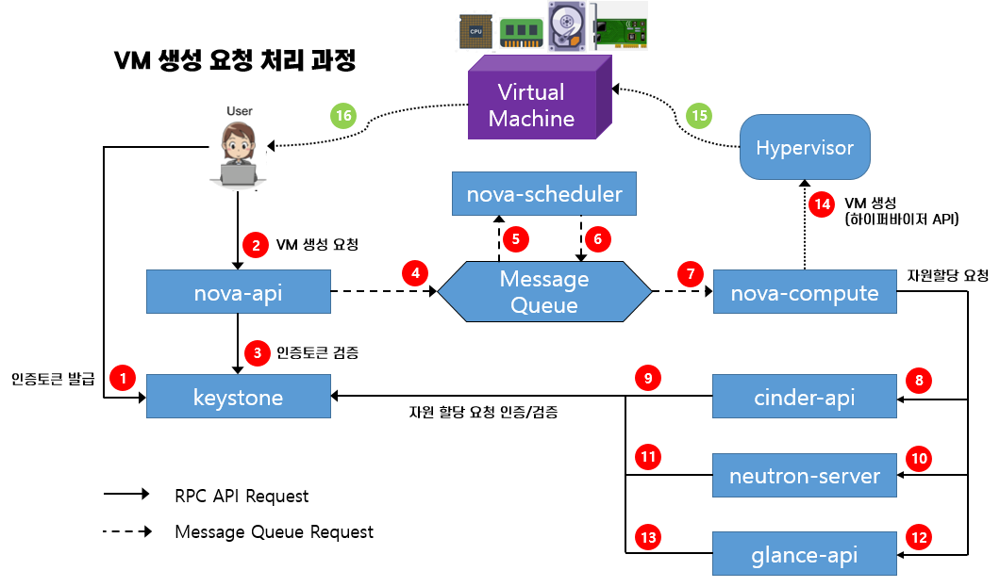
  <figcaption>VM 생성 과정</figcaption>
</figure>

그림은 Nova 서비스에서 사용자의 VM 생성 요청을 처리하는 과정을 간략하게 나타냅니다.

- ❶ - 사용자는 keystone에 credential을 제공하여 인증하고, 인증 토큰을 발급 받습니다.
- ❷ - 사용자는 1번 과정에서 받은 인증 토큰과 API EndPoint를 이용해 nova-api 로 VM 생성 요청을 보냅니다.
- ❸ - nova-api는 사용자로부터 받은 VM 생성 요청을 Keystone으로 보내 검증합니다.
- ❹, ❺ - 검증이 완료되면, nova-api는 Message Queue를 통해 VM 생성 요청을 nova-scheduler에게 보냅니다.
- ❻, ❼ - nova-scheduler는 현재 자원 할당 현황, 메타데이터 등을 참고하여 VM을 생성할 컴퓨트 노드를 결정하고, 결정된 노드의 nova-compute 로 Message Queue를 통해 VM 생성 요청을 전달합니다.
- ❽, ❿, ⓬ - VM 생성 요청을 받은 nova-compute 는 VM에 연결할 볼륨과, 네트워크 자원, 이미지 등을 얻기 위해, cinder-api, neutron-server, glance-api 로 필요한 자원 할당을 요청합니다.
- ❾, ⓫, ⓭ - cinder-api, neutron-server, glance-api 는 nova-compute 가 보낸 자원 할당 요청을 Keystone을 통해 인증 후, 자원을 할당하여 nova-compute로 응답을 전송합니다.
- ⓮ - 8번~13번의 과정을 통해 자원을 성공적으로 할당받으면, nova-compute는 하이퍼바이저 API를 호출하여 VM을 생성합니다.
- ⓯ - 생성한 VM과 할당받은 자원을 연결하고, 최종적으로 사용 가능한 VM을 시작합니다.
- ⓰ - 사용자는 VM에 할당된 Floating IP, Fixed IP 로 SSH로 접근하거나, VNC Console 등을 이용해 VM에 접근하여 사용할 수 있습니다.

앞서 살펴본 코어 서비스들은 결국 클라우드 서비스를 위한 최소한의 필요 조건인 VM 인스턴스를 생성하기 위한 과정이라고 할 수 있습니다. 이후에, 다른 프로젝트를 추가해서 클라우드 서비스를 확장할 수 있습니다. 가령, 생성된 VM 인스턴스에 Database를 올려서 DBaaS를 서비스 하는 Trove 프로젝트를 추가하여 확장하거나, VM 인스턴스를 활용하는 자체 서비스를 개발하여 클라우드 서비스를 확장할 수도 있습니다.

### 참고 자료
Nova(Rocky) documents - [https://docs.openstack.org/nova/rocky/](https://docs.openstack.org/nova/rocky/)  